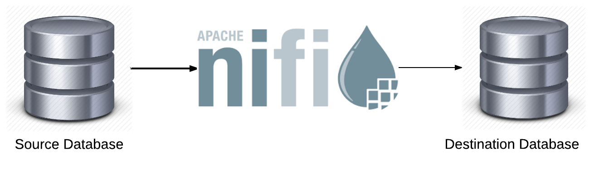

Como ya vimos en el primer tema, **ETL** (*Extract, Transform, Load*) es un proceso fundamental en la gestión de datos que implica la extracción de datos de diversas fuentes, su transformación para cumplir con los requisitos empresariales y su carga en un sistema de almacenamiento, como una base de datos relacional.

    

En este caso, el proceso **ETL** lo vamos a realizar utilizando **Apache NiFi**, haremos usu de la base de datos NoSQL **mongoDB** que ya hemos visto en el tema anterior, pero también usaremos una Base de Datos Relacional como será en este caso **PostgreSQL**, por lo que en este tema, veremos brevemente esta base de datos.

Así pues los pasos que seguiremos:

1. Instalación y configuración de **PostgreSQL**
2. Instalación y configuración de **Apache NiFi**
3. **ETL** usando **Apache NiFi** junto con **PostgreSQL** y **MongoDB**