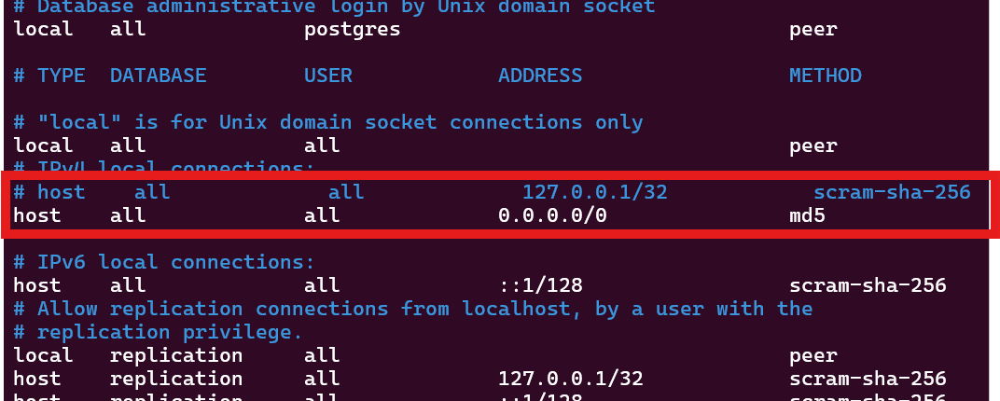
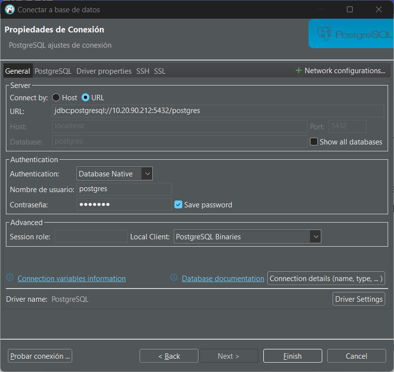
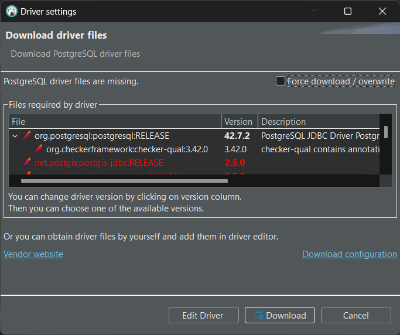

`PostgreSQL`, también llamado `Postgres`, es un sistema de gestión de bases de datos relacional orientado a objetos y de código abierto, publicado bajo la licencia PostgreSQL,1​ similar a la BSD o la MIT. 

Los datos de los sistemas de Big Data se pueden guardar de formas diferentes. Para nuestro módulo en concreto, necesitamos una base de datos donde *cargar* (ET**L**) los datos extraídos antes de su tratamiento final, y utilizaremos esta base de datos.

## Instalación de `PostgreSQL`

### Instalación en *Ubuntu* (derivados *Debian*)

PostgreSQL se encuentra en el repositorio apt de Ubuntu por lo cual la instalación es sencilla. Se recomienda seguir los pasos de instalacion y configuración de la web de [Ubuntu Server - Install PostgreSQL](https://ubuntu.com/server/docs/install-and-configure-postgresql)

No obstante, los pasos son senciallos y para dejar el sistema preparado basta con seguir ejecutar: 

```bash 
sudo apt install postgresql
```

Para su configuración, en primer lugar editamos el fichero de configuración y permitimos que se pueda conectar desde cualqier dirección: 

```bash 
sudo nano /etc/postgresql/16/main/postgresql.conf
```

Localizamos la línea 

    #listen_addresses = ‘localhost’

y la cambiamos por 

    listen_addresses = '*'

Continuamos asignando una contraseña al usuario `postgres` para poder entrar en el sistema. Para ello ejecutamos:

```bash
sudo -u postgres psql template1
```

con esto entrmos en la consola de postgres, dentro de la base de datos template1, y ahí podemos ejecutar la siguiente instrucción donde podemos especificar nuestra contraseña:

```sql
ALTER USER postgres with encrypted password 'your_password';
```

Después de configurar la contraseña, debemos permitir autentificarse en el servidor para lo cual editaremos el fichero `/etc/postgresql/16/main/pg_hba.conf` y permitiremos autentificacion mediante protocolo `md5`. Para ello

```bash
sudo nano /etc/postgresql/16/main/pg_hba.conf
```
y localizamos la línea 

    host    all     all     127.0.0.1/32    scram-sha-256

y la sustituimos por 

    host    all     all     0.0.0.0/0    md5

lo que permitirá autentificarmos por medio de `md5` desde cualquier equipo. Quedará algo así: 

<figure markdown="span" align="center">
  { width="85%"  }
  <figcaption>/etc/postgresql/16/main/pg_hba.conf</figcaption>
</figure>


y ya tenemos el sistema preparado para conectarnos desde el exterior y con su contraseña establacecida, así que reiniciamos el servicio:

```bash
sudo systemctl restart postgresql.service
```

y ya tenemos el sistema preparado.

### Instalación en *CentOS* (derivados *Red Hat*)

Para la instalación de `Postgres` en `CentOS` seguiremos el siguiente [Articulo: How to install PostgreSQL on CentOS](https://www.commandprompt.com/education/how-to-install-postgresql-on-centos/)

Sobre esta guía, cabe aconsejar realizar los siguientes cambios en el fichero de configuración `/var/lib/pgsql/data/pg_hba.conf` (el cual debe editarse como `root`)

<div align="center">
    
</div>

Observar en la imagen que se ha cambiado *peer* e *ident* por ***md5*** para las conexiones locales (desde el terminal) o mediante IPv4, de esta forma podremos conectando usando un usuario y contraseña cualquiera que se encuentre en Postgres

Nota: Si este cambio no se realiza, al intentar conectarnos, encontraremos un error del tipo: `PSQLException: FATAL: la autentificación Ident falló para el usuario «sergio»`

### Creación y acceso de roles/usuarios y bases de datos desde consola

Por defecto, la autentificación es mediante *roles*. Al principio se asocia un rol a una cuenta existente en nuestro sistema Linux. Esta cuenta tiene el nombre de **postgres** y se crea automáticamente al instalar `PostgreSQL`. 

No hay una contraseña por defecto del rol **postgres**. El modo de autenticación por defecto para `PostgreSQL` está configurado como `ident`, no como sql DB user/password. Lo que realmente significa es que para conectarse correctamente a `PostgreSQL` debe iniciar sesión como el usuario correcto del sistema operativo que se utilizó para instalarlo. Prácticamente se autentifica con el usuario del SO, por eso hemos realizado los cambios descritos anteriormente.

Por lo tanto, para comenzar la primera vez en el terminal de la base de datos PostgreSQL, debemos cambiarnos a este usuario **postgres**:

```bash
$ sudo -i -u postgres   # cambiamos al usuario postgres 
```
Una vez estamos dentro de la terminal del usuario postgres, ya tenemos permisos para entrar en la propia terminal de PostgreSQL, mediante el comando `psql`

```bash
postgres@server:~$ psql # para entrar 

postgres=# \q       # para salir
```

y ya que estamos

```bash
postgres=# \l               # listado de base de datos
postgres=# \d               # listado de tablas de base de datos activa
postgres=# \c <database>    # para cambiar de base de datos
```

El rol de `postgres` es administrador, y aunque nosotros podemos utilizarlo, cabe indicar que no es correcto utilizarlo para acceder al sistema, es mejor crear nuevos roles, e incluso crear un rol para cada base de datos nueva que utilicemos.

Para **crear nuevos roles**, normalmente lo hacemos desde el usuario linux `postgres`:

```bash
postgres@server:~$ createuser --interactive
```
En este caso nos pide el usuario y la contraseña

Una vez creado el usuarios, le debemos asignar una contraseña y darle los permisos necesarios:

```postgres
postgres=# ALTER USER sergio WITH ENCRYPTED PASSWORD 'sergio'; 
postgres=# GRANT ALL PRIVILEGES ON DATABASE <basededatos> to <usuario>; 
```
por supuesto, antes de dar privilegios de acceso a una base de datos, se debe crear desde el usuario `postgres`:

```bash
$ createdb pruebas
```

!!! tip

    Todo lo anterior lo podemos realizar directamente una vez estamos el el terminal de `postgres`, creamos los roles y la base de datos utilizando sentencias SQL
 
    ```postgres
    postgres=# CREATE ROLE sergio LOGIN PASSWORD 'sergio';
    CREATE ROLE
    postgres=# CREATE DATABASE pruebas WITH OWNER = sergio;
    CREATE DATABASE
    ```

!!! Nota
    Normalmente, si creamos un rol en Postgres, debemos tener un usuario con el mismo nombre en nuestro sistemas Linux, de forma que ambos están ligados.

Para entrar en una base de datos desde el terminal

```bash
psql -d pruebas         # para entrar en la BBDD (si estamos en un usuario autorizado)
su sergio               # para cambiarnos a un usuario autorizada, antes de entrar en la BBDD 

psql -U sergio -d pruebas --password    # para entrar en la base de datos directamente con un usuario determinado.
```

!!! info
    Si el usuario no lo tenemos creado en el sistema, debemos crearlo
    ```bash
    sudo useradd -m sergio          # creamos el usuario
    sudo passwd sergio              # le damos contraseña para activarlo.
    sudo usermod -aG sudo sergio   # para hacer meter el usuario en el grupo "sudo". Esto no es necesario.
    ```

Desde aquí, ya podemos crear tablas, y trabajar datos desde este terminal.


Una vez creada una base de datos, es interesante **probar la conexión** que hemos establecido para verificar que funciona, se podría hacer desde el terminal, mediante el comando `psql`:

```bash
psql -d postgresql://127.0.0.1:5432/pruebasnifi?user=sergio
```
donde especificamos la base de datos y el usuario, en este ejemplo son *pruebasnifi* y *sergio* respectivamente 


## DBeaver

`DBeaver` es una aplicación de software cliente de SQL y una herramienta de administración de bases de datos muy ligera y sencilla. Es menos pesada que herramientas como `pgAdmin`, y además mediante esta herramienta podemos **instalar los drivers necesarios** para la posterior conexión de `Apache NiFi` a nuestras bases de datos en `PostgreSQL`, por ejemplo, por lo que vamos a hacer uso de esta herramienta.

Para su **instalación** descargar versión *Comunity* desde : [https://dbeaver.io/download/](https://dbeaver.io/download/)

Por supuesto descargamos el paquete adecuado a nuestro sistemas operativo.

Después, abrimos un terminal y instalamos y ejecutamos (en CentOS):

```bash
sudosudo dpkg -i dbeaver-<version>.deb    # instalación 
dbeaver &                                 # ejecución de dbeaver
```

Una vez tenemos instalado DBeaver, lo inciamos y configuramos la conexión a nuestra base de datos PostgreSQL:

<figure markdown="span" align="center">
  { width="75%"  }
  <figcaption>Creando conexión con BBDD PostgreSQL</figcaption>
</figure>


Cuaod **Probemos la conexión** o intentemos **conectarnos**, la primera vez nos dirá que nos faltan los *drivers* para conectarse a *PostgreSQL*, y nos permite la instalación automatica.

<figure markdown="span" align="center">
  { width="75%"  }
  <figcaption>Instalación automática de drivers para PostgreSQL</figcaption>
</figure>

A partir de este momento, ya tenemos conexión con la base de datos y podemos utilizar DBeaver para crear bases de datos y tablas.
