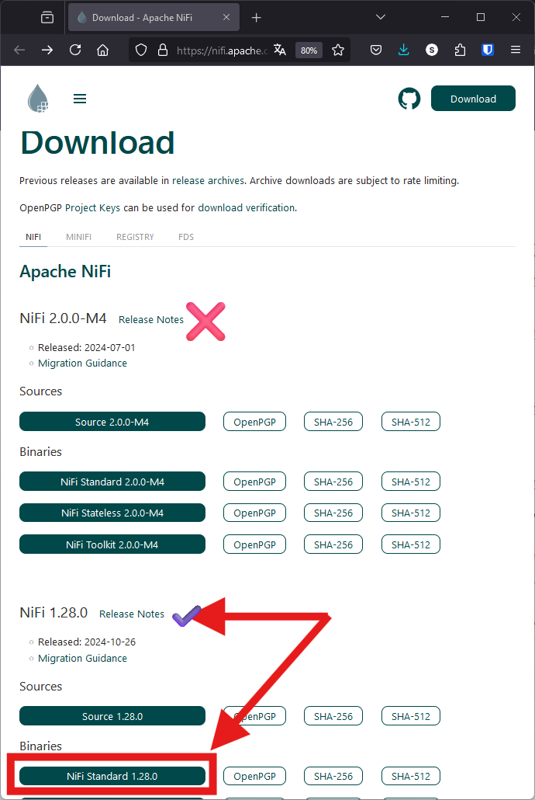
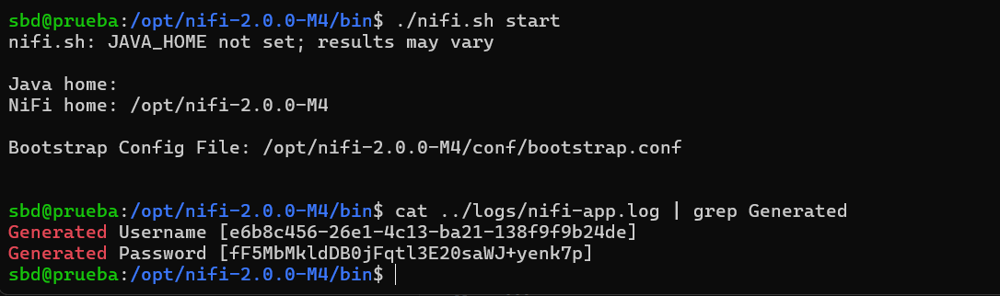
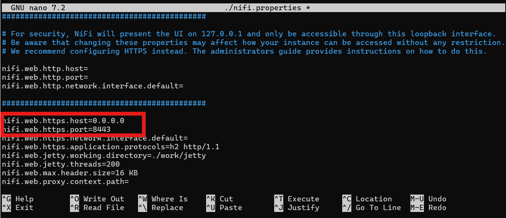
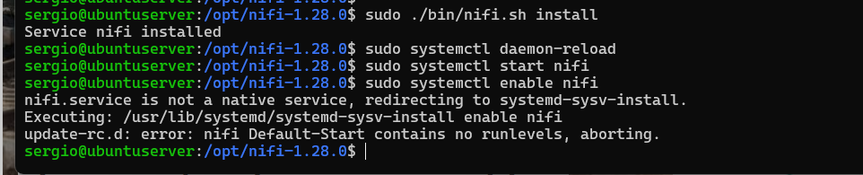
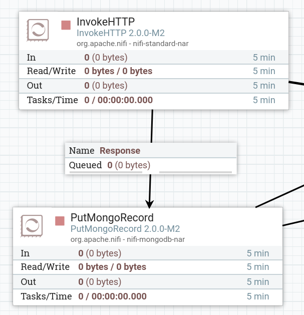
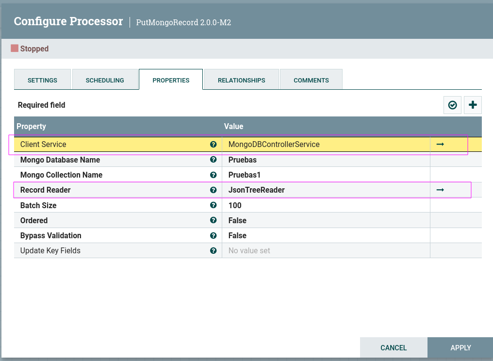
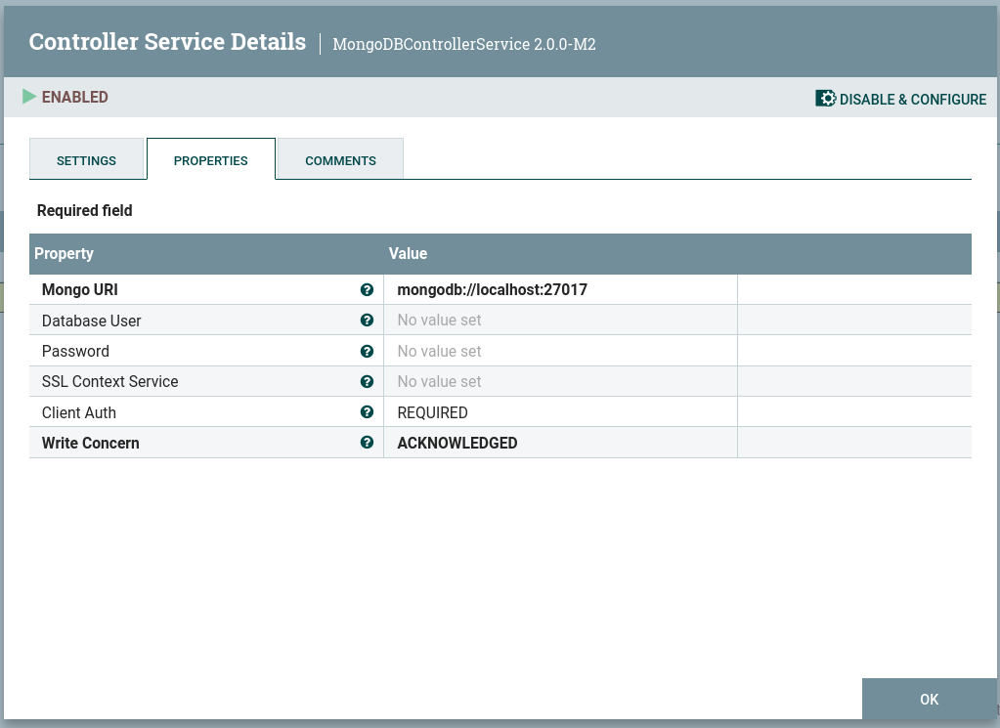
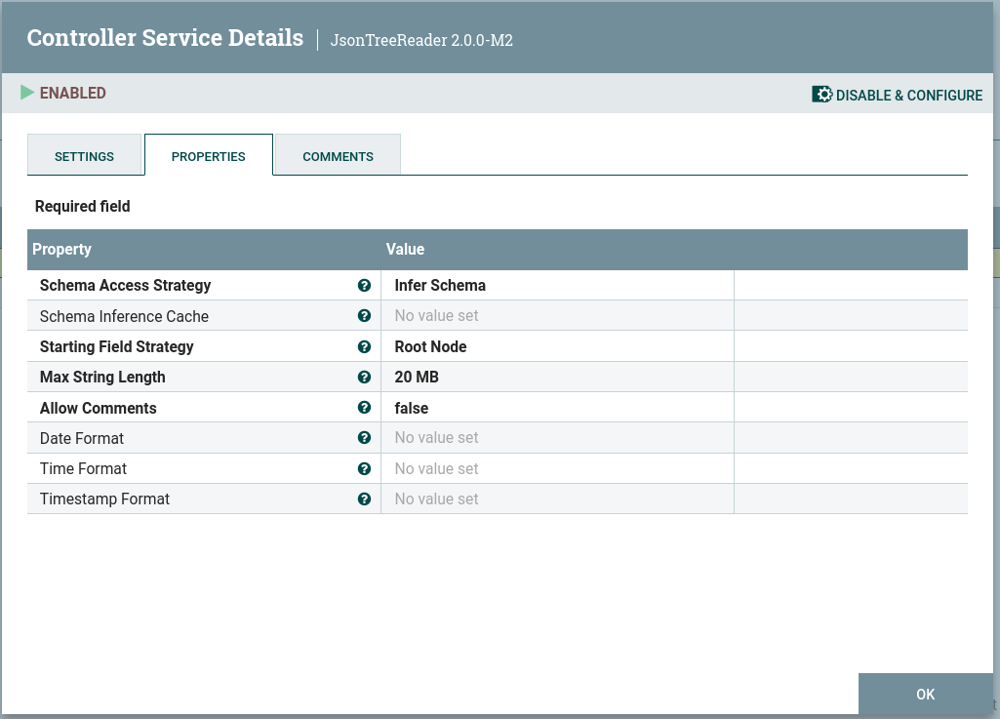

`Apache NiFi` es una plataforma de procesamiento y logística de datos en tiempo real, que permite automatizar el movimiento de datos entre diferentes sistemas. 

Es un sistema distribuido, Open Source y desarrollado por la ***Apache Software Foundation***. 

`Apache NiFi` ofrece una gestión de flujos de datos complejos, con trazabilidad y control de los datos que se reciben, transforman, envían o descartan34.

!!! Info "En la web del proyecto podemos encontrar la siguiente definición"

    An easy to use, powerful, and reliable system to process and distribute data.

`NiFi` (o Ni-Fi) ha sido diseñado para poder automatizar de una manera eficiente y visual los flujos de datos entre distintos sistemas: ingesta, enrutado y gestión. Para ello, cuenta con más de 300 conectores externos ya implementados y además es posible añadir conectores a medida.

Uno de los puntos fuertes de `NiFi` es la capacidad para programar flujos de datos arrastrando y conectando los componentes necesarios sobre los canvas de la web de administración. No es necesario por tanto tener conocimientos de programación específicos, sino entender y configurar correctamente cada uno de los componentes que se quieren usar.

Aunque se pueda considerar una herramienta **ETL**, `NiFi` no está realmente optimizado para realizar transformaciones de datos complejas o pesadas. Es posible realizar transformaciones de datos ligeras pero no es un motor de transformaciones batch completo. Aún así es común su uso integrado en sistemas ***Big Data***, ya que ofrece muchas ventajas como herramienta de automatización de ingestas de datos y para realizar transformaciones y limpiezas sencillas.


## Instalación `Apache Nifi`

Para la instalación de NiFi, descargamos la última versión desde la [web de nifi](https://nifi.apache.org/download/); archivo binario.

!!! Atención
	Cuidado, si descargamos la version 2.0 necesitamos realizar una configuración más avanzada del servidor, incluidos ceertificados, por lo que nosotros vamos a trabajar con version 1.xxx

<figure markdown="span" align="center">
	{ width="50%"  }
	<figcaption>Descargamos versión 1.xx para evitar problemas de configuración</figcaption>
</figure>


Podemos descargar directamente desde la web mediante `wget`:

```
wget https://dlcdn.apache.org/nifi/1.28.0/nifi-1.28.0-bin.zip
```
Lo descomprimimos y ...

```bash
unzip nifi-1.28.0-bin.zip
```
!!! tip "si no tenemos instalado 'unzip' en nuestro sistema, recordad que para instalar"
	```bash
	sudo apt install unzip
	```

y lo dejamos en la ubicación adecuada y ya podemos ejecutarlo.

```bash
sudo mv nifi-1.28.0 /opt
cd /opt/nifi-1.28.0/bin
./nifi.sh start             # iniciamos nifi en background
```

!!! tip "El sistema debe tener instalada una máquina virtual de Java (JRE) para poder ejecutarse, asi que recordad que para instalar, por ejemplo:"
	```bash
	sudo apt install default-jre
	```

El usuario se puede crear vía comandos por cmd, o se puede coger el que genera automáticamente en el log NiFi, algo asi (fichero nifi-app.log):

```bash 
$ cat ../logs/nifi-app.log | grep Generated
Generated Username [80e91118-b222-4b47-8dab-63a8deb7905d]
Generated Password [zavwbGlRcYeky51Bxc0zbVN8hj2bE61u]
```

<figure markdown="span" align="center">
  { width="85%"  }
  <figcaption>Iniciando nifi y obteniendo usuario y contraseña por defecto</figcaption>
</figure>

!!! tip  "Para establecer un usuario y contraseña, lo podemos hacer con el siguiente comando" 
	```bash
	./bin/nifi.sh set-single-user-credentials sergio sergiosergio  
	```
	usuario que desees y contraseña de 12 caracteres mínimo

Por último, comentar que hay diferentes forma de iniciar/operar con ***Apache Nifi***, arrancando NiFi cada vez que deseemos usarlo desde la línea de comandos o creando un servicio y que inicia de forma automática


### Iniciando desde línea de comandos

Si queremos iniciar Nifi desde la línea de comandos (recomendado sobre todo en nuestro primera arranque), tenemos los siguientes comandos:

```bash
./nifi.sh start   # ejecución en segundo plano
./nifi.sh run     # ejecución en primer plano
./nifi.sh status  # saber estado... si se esta ejecutando
./nifi.sh stop    # para 
```


Dependiendo de la máquina donde la ejecutemos, puede tarda un poco en ponerse en marcha, hasta 5 minutos.

Luego accedemos en `https://localhost:8443/nifi`

!!! Note

	Si accedemos desde una máquina remota, entonces debemos cambiar la configuración del archivo **conf/nifi.properties**

	Debemos cambiar las siguientes líneas:

	```js
	nifi.web.http.host=0.0.0.0
	nifi.web.http.port=8080
	```

	<figure markdown="span" align="center">
		{ width="85%"  }
		<figcaption>Iniciando nifi y obteniendo usuario y contraseña por defecto</figcaption>
	</figure>

### Iniciando como servicio

Por último, si queremos que **Nifi** se instale como **servicio** y se inicie de forma automática cada vez que iniciamos el sistema, realizamos los suguientes pasos

```bash
sudo /opt/nifi/bin/nifi.sh install
sudo systemctl daemon-reload
sudo systemctl start nifi
sudo systemctl enable nifi
```

<figure markdown="span" align="center">
  { width="85%"  }
  <figcaption>Iniciando NiFi como servicio</figcaption>
</figure>


Más información en la [web de apache nifi](https://nifi.apache.org/docs/nifi-docs/html/getting-started.html#downloading-and-installing-nifi)


## Terminología NiFi


### Los conceptos fundamentales de NiFi

`Nifi` esta basado en FBP (Flow Based Programming), que es un paradigma de programación que define aplicación como cajas negras (procesos), los cuales intercambian datos entre conexiones predefinidas.

A continuación se indican algunos de los conceptos principales de NiFi y cómo se mapean a FBP:


| Término de NiFi | Término de FBP | Descripción |
|-----------------|----------------|-------------|
| **FlowFile**    | Paquete de Información | Un FlowFile representa cada objeto que se mueve a través del sistema y para cada uno, NiFi realiza un seguimiento de un mapa de pares clave/valor de atributos y su contenido asociado de cero o más bytes. |
| **FlowFile Processor** | Caja Negra | Los procesadores realizan el trabajo. En términos de [eip], un procesador realiza alguna combinación de enrutamiento de datos, transformación o mediación entre sistemas. Los procesadores tienen acceso a los atributos de un FlowFile dado y su flujo de contenido. Los procesadores pueden operar en cero o más FlowFiles en una unidad de trabajo dada y ya sea comprometer ese trabajo o revertirlo. |
| **Connection** | Búfer Acotado | Las conexiones proporcionan el enlace real entre procesadores. Actúan como colas y permiten que varios procesos interactúen a diferentes velocidades. Estas colas pueden priorizarse dinámicamente y pueden tener límites superiores de carga, lo que permite la retropresión. |
| **Flow Controller** | Programador | El Flow Controller mantiene el conocimiento de cómo se conectan los procesos y gestiona los hilos y las asignaciones de los mismos que todos los procesos utilizan. El Flow Controller actúa como el intermediario que facilita el intercambio de FlowFiles entre procesadores. |
| **Process Group** | Subred | Un Process Group es un conjunto específico de procesos y sus conexiones, que pueden recibir datos a través de puertos de entrada y enviar datos a través de puertos de salida. De esta manera, los grupos de procesos permiten la creación de componentes completamente nuevos simplemente mediante la composición de otros componentes. |


Estas cajas negras (procesos) pueden ser combinados en dataflows. 

### DataFlow

- `Dataflow` o `flujo de dato` son los pasos de los datos desde el origen al destino, con o sin transformación en medio.

Los datos pueden ser de diversos formatos, csv, json, videos, audios, .... 

`Apache Nifi` esta diseñado para automatizar el movimiento de datos.

No es recomendable para hacer transformaciones grandes o de tipo batch, en ese caso tenemos ***spark***

Esta basada en la **programación basada en flujo**, basada en unos procesadores que se unen mediante conexiones.

Estos procesadores son como cajas negras, y los conectores cogen los datos de un procesador y lo entregan a otro, de forma que a los procesadores no les interesa la salida, solo el proceso

### FlowFile

Los ficheros que se generan entre diferentes procesadores se llaman `flowfiles`, con paquetes de datos (como ficheros) compuesto por contenido y atributos o metadatos. Los atributos contienen información del contenido; fecha de creación, nombre, o información que añadamos.

Contiene datos. Abstracción de los datos en NiFi -->  CSV,JSON,XML,SQL,Binary,etc

Tiene dos componentes:
- Content:  contiene los datos actuales.
- Attributes: representa los metadatos del fichero
	
Son ficheros persistentes en disco.

Este paquete de datos que viaja por el flow entre los procesadores está compuesto por un puntero al propio dato útil o contenido (un array de bytes) y metadatos asociados llamados atributos. Los atributos pares clave-valor editables y NiFi los usa para enriquecer la información de provenance. Los metadatos más importantes son el identificador (uuid), el nombre del fichero (filename) y el path. Para acelerar el rendimiento del sistema, el flowfile no contiene el propio dato, sino que apunta al dato en el almacenamiento local. Muchas de las operaciones que se realizan en NiFi no alteran el propio dato ni necesitan cargarlo en memoria. En concreto, el dato se encuentra en el llamado repositorio de contenido (Content Repository) Flowfile de Apache NiFi.

### Processors

- `Processor`: un Processor puede generar un nuevo "FlowFile" para procesar o ingestar un existente FlowFile desde cualquier origen. Todos los processors pueden ser conectados con otros. Estos, son enlazados vía conexiones con links. Cada conexión tendrá una cola "Queue for FlowFiles".

Puede añadir, actualizar y borrar atributos de un FlowFile
Puede cambiar el contenido a un FlowFile.

- Input/Output: entrada y salida són utilizados para mover datos entre "Process Group".

- Controller Service: servicio compartido que puede usado por un Processor. Este servicio puede mantener
conexiones con bases de datos. Por ejemplo, CSV Reader, JSON Writer, etc.

Los procesadores son los encargados de realizar las transformaciones o acciones sobre los datos. Se pueden configurar para que se ejecuten según una temporización, tipo cron. Proporcionan una interface para acceder a los flowfiles. Hay procesadores ya creados y publicados o podemos crear nuevos, utilizando java.


### Processors más usados

Apache Nifi ofrece diferentes tipos de **procesadores**, y los más utilizados o importantes son: 

**Ingesta de datos**

	GenerateFlowFiles
	GetFile
	GetFTP
	GetSFTP
	GetJMSQueue
	GetJMSTopic
	GetHTTP
	ListenHTTP
	ListenUDP
	getHDFS
	GetKafka
	QueryDatabaseTable
	GetMongo
	GetTwitter
	ListHDFS / FetchHDFS


**Transformación del datos**. Permiten transformar datos antes de almacenar en destino

	ConvertRecord
	UpdateRecord
	ConvertJSONToSQL
	ReplaceText
	CompressContent
	ConvertCharacterSet
	EncryptContent
	TransformXml
	JoltTransformJSON
	
**Envío de datos**. Ayudan a enviar los datos a un destino

	PutEmail
	PutFile
	PutFTP
	PutSFTP
	PutJMS
	PutSQL
	PutKafka
	PutMongo
	PutHDFS

**Control y revisión**. Enrutan el dato por el flujo adecuado

	ControlRatte
	DetectDuplicate
	DistributeLoad
	RouteOnAttribute
	RouteOnAttribute
	RouteOnContent
	ScanAttribute
	ScanContent
	ValidateXml
	ValidateCSV
	
**Acceso a base de datos**

	ConvertJSONToSQL
	ExecuteSQL
	PutSQL
	SelectHiveQL
	PutHiveQL
	ListDatabaseTables
	
**Extracción de atributos**. Añade o extrae atributos de los FlowFiles
	
	EvaluateJsonPath
	EvaluateXPath
	EvaluateXQuery
	ExtractText
	HashAttribute
	HashContent
	IdentifyMimeType
	UpdateAttribute
	LogAttribute

**Sistema**

	ExecuteProcess
	ExecuteStreamCommand
	
**Agregaciones y Splits**
	
    SplitText
	SplitJson
	SplitXml
	SplitRecord
	SplitContent
	UnpackContent
	SegmentContent
	MergeContent
	QueryRecord

**Http y udp**

	GetHTTP
	ListenHTTP
	InvokeHTTP
	PostHTTP
	HandleHttpRequest
	HandleHttpRespone
	ListenUDP
	PutUDP
	ListenUDPRecord
	
**AWS**

	FetchS3Object
	PutS3Object
	PutSNS
	GetSQS
	PutSQS
	DeleteSQS
	GetDynamoDB
	PutDynamoDB
	PutLambda

### Conexiones

Las **Conexiones** permiten transmitir flowFiles entre procesadores. Se encargan de controlar colas y su caducidad, por ejemplo ante procesadores que van a diferentes velocidades, o encola o deciden que datos tienen más prioridad o que datos ya han quedado obsoletos.

### Process Groups

Los **Process Groups** es la unión de varios procesadores que tiene una tarea de forma agrupada.

Son conjuntos de componentes Processor combinados. Ayudan a mantener un gran y complejo dataflow.


###  Controller Services

Los `Controller Services` en Apache `NiFi` son **servicios compartidos** que pueden ser utilizados por los procesadores, tareas de informes y otros servicios de controlado. Estos servicios proporcionan una funcionalidad común que puede ser utilizada por varios componentes de NiFi. 

Algunos ejemplos de servicios de controlador incluyen servicios de autenticación, servicios de encriptación y servicios de base de datos.

## Apache NiFi Expression Language

El lenguaje de expresiones en Apache NiFi es una forma de especificar patrones de texto que se pueden utilizar para buscar, reemplazar o extraer información de los atributos y el contenido de los archivos de flujo. El lenguaje de expresiones de NiFi permite referenciar estos atributos, compararlos con otros valores y manipular sus valores. 

El lenguaje de expresiones de NiFi siempre comienza con el delimitador de inicio `${` y termina con el delimitador final `}`. Entre los delimitadores se encuentra el texto de la expresión en sí. En su forma más básica, la expresión puede consistir en solo un nombre de atributo. 

Por ejemplo, `${filename}` devolverá el valor del atributo filename. En un ejemplo un poco más complejo, podemos devolver una manipulación de este valor. Podemos, por ejemplo, devolver una versión en mayúsculas del nombre de archivo llamando a la función `${filename:toUpper()}`. En este caso, referenciamos el atributo y luego manipulamos este valor usando la función toUpper. 

Otro ejemplo de uso de este tipo de expresiones lo encontramos en la práctica 8, de forma que generamos un fichero json con valores aleatorios

```
{
	"title": "mr",
	"first": "John ${random():mod(10):plus(1)}",
	"last": "Doe ${random():mod(10):plus(1)}",
	"email": "johndoe${random():mod(10):plus(1)}nail.com",
	"created_on": "${now():toNumber()}"
}
```

Sirva como base el documento [Apache Nifi Expression Language Cheat Sheet](https://www.nifi.rocks/documents/nifi-expression-language-cheat-sheet.pdf)

Mas Información en [Apache NiFi Expression Language Guide](https://nifi.apache.org/docs/nifi-docs/html/expression-language-guide.htm)

## Expresiones regulares

Las expresiones regulares son una forma de especificar patrones de texto que se pueden utilizar para buscar, reemplazar o extraer información de cadenas. Apache NiFi es una plataforma de gestión de flujos de datos que permite procesar y distribuir datos de forma eficiente y fiable. NiFi tiene su propio lenguaje de expresión, que se puede utilizar para referenciar y manipular los atributos y el contenido de los archivos de flujo. El lenguaje de expresión de NiFi soporta el uso de expresiones regulares para realizar operaciones como:

- Validar el formato o el contenido de un atributo o una cadena usando la función matchesRegex.
- Extraer una parte de un atributo o una cadena usando la función replaceRegex.
- Reemplazar una parte de un atributo o una cadena usando la función replaceAll.
- Dividir un atributo o una cadena en una lista usando la función split.

Algunos ejemplos de uso de expresiones regulares en NiFi son:

!!! Example "Ejemplo 1"
    Para extraer el nombre de dominio de una URL, se puede usar la expresión 
    
  	```${url:replaceRegex('^(?:https?://)?([^/]+)(.*)$', '$1')}```
  	
  	En este ejemplo, si el atributo `url` tiene el valor https://nifi.apache.org/some%20value%20with%20spaces, la expresión devolverá *nifi.apache.org*.
    
!!! Example "Ejemplo 2"
		Para validar que un atributo email tiene un formato válido, se puede usar la expresión 
		
  	```${email:matchesRegex('^[\\w.-]+@[\\w.-]+\\.[\\w]{2,}$')}```
		
		Por ejemplo, si el atributo email tiene el valor *user@example.com*, la expresión devolverá true.


!!! Example "Ejemplo 3"
		Para reemplazar los espacios por guiones en un atributo filename, se puede usar la expresión 

		`${filename:replaceAll('\\s', '-')}`

		Por ejemplo, si el atributo *filename* tiene el valor *my document.txt*, la expresión devolverá *my-document.txt*.

!!! Example "Ejemplo 4"
		Para dividir un atributo tags en una lista separada por comas, se puede usar la expresión 

		`${tags:split(',')}`

		Por ejemplo, si el atributo tags tiene el valor *nifi,data,regex*, la expresión devolverá '[nifi, data, regex]'.

Ante cualquier duda, las expresiones regulares de Apache NiFi siguen las nomenclatura de Java

A continuación, te presento una tabla con algunos ejemplos de expresiones regulares de Java y su descripción:

| Expresión regular | Descripción | 
| --- | --- |
| \\d | Coincide con un dígito del 0 al 9 |
| \\w | Coincide con una letra, un dígito o un guión bajo |
| \\s | Coincide con un espacio en blanco |
| . | Coincide con cualquier carácter excepto el salto de línea |
| [abc] | Coincide con cualquiera de los caracteres a, b o c |
| [^abc] | Coincide con cualquier carácter que no sea a, b o c |
| [a-z] | Coincide con cualquier letra minúscula del alfabeto inglés |
| [A-Z] | Coincide con cualquier letra mayúscula del alfabeto inglés |
| [0-9] | Coincide con cualquier dígito del 0 al 9 |
| [a-zA-Z0-9] | Coincide con cualquier letra o dígito |
| ^ | Coincide con el inicio de la cadena o de la línea |
| $ | Coincide con el final de la cadena o de la línea |
| ? | Indica que el carácter o la expresión anterior puede aparecer cero o una vez |
| + | Indica que el carácter o la expresión anterior puede aparecer una o más veces |
| * | Indica que el carácter o la expresión anterior puede aparecer cero o más veces |
| {n} | Indica que el carácter o la expresión anterior debe aparecer exactamente n veces |
| {n,m} | Indica que el carácter o la expresión anterior debe aparecer entre n y m veces, ambos inclusive |
| {n,} | Indica que el carácter o la expresión anterior debe aparecer al menos n veces |
| {,m} | Indica que el carácter o la expresión anterior debe aparecer como máximo m veces |
` 	` |
| ( ) | Agrupa una subexpresión dentro de la expresión regular |
| \\ | Escapa el carácter siguiente para que se interprete como un carácter normal |


Otros ejemplos de uso: 

!!! Example 

	Por ejemplo, para validar que una cadena es una dirección de correo electrónico válida, se puede usar la siguiente expresión regular:

	``` 
	^[\\w.-]+@[\\w.-]+\\.[\\w]{2,}$
	```

	Esta expresión regular significa lo siguiente:

	- ^: coincide con el inicio de la cadena.
	- [\\w.-]+: coincide con una o más repeticiones de letras, dígitos, puntos o guiones.
	- @: coincide con el símbolo arroba.
	- [\\w.-]+: coincide con una o más repeticiones de letras, dígitos, puntos o guiones.
	- \\.: coincide con un punto literal.
	- [\\w]{2,}: coincide con dos o más repeticiones de letras o dígitos.
	- $: coincide con el final de la cadena.

!!! Example 

	El siguiente ejemplo de una expresión regular en Java para identificar un fichero con extensión `.json` sería la siguiente:

	```
	.*\.json
	```

	Esta expresión regular significa lo siguiente:

	- .*: coincide con cualquier número de caracteres, excepto el salto de línea.
	- \.: coincide con un punto literal. Se usa el carácter \ para escapar el punto, ya que este es un metacarácter que tiene otro significado en las expresiones regulares.
	- json: coincide con la cadena literal “json”.

De esta forma, la expresión regular coincide con cualquier fichero que termine en “.json”, como por ejemplo “datos.json” o “configuracion.json”.
En la tabla siguiente se muestran otros ejemplos de expresiones regulares en Java y su descripción:

| Expresión regular | Descripción |
| --- | --- |
| ^\\\d{9}-[A-Z]$ | Coincide con un NIF formado por 9 dígitos, un guión y una letra mayúscula. |
| ^\\\d{2}/\\\d{2}/\\\d{4}$ | Coincide con una fecha en formato dd/mm/aaaa. |
| ^\\\+?\\\d{1,3}-\\\d{3}-\\\d{3}-\\\d{3}$ | Coincide con un número de teléfono internacional con código de país opcional. |
| ^(?=.\*[A-Z])(?=.\*[a-z])(?=.\*[0-9])(?=.\*[@#$%^&+=]).{8,}$ | Coincide con una contraseña que tenga al menos 8 caracteres, una letra mayúscula, una letra minúscula, un dígito y un carácter especial. |


## Uso de `MongoDB` con `Apache Nifi`

Otros de los usos típicos que podemos tener es el almacenamiento de un ETL utilizando `Apache Nifi` y `MongoDB`

Veamos la configuración de `Nifi` para poder almacenar datos en `MongoDB`

En primer lugar para la ingesta de datos en MongoDB, utilizamos el Processor `PutMongoRecord` o `PutMongo`

<div align="center">
    
</div>

Dentro del processor, debemos configurar dos servicios: 

<div align="center">
    
</div>

Los cuales quedan configurados como sigue:

<div align="center">
    
    
</div>

El servicio `JsonTreeReader` no es necesario modificarlo, y el `MongoDBControllerService` simplemente asignamos la propiedad de **Mongo URL**


## Ejercicio en NiFi

De la AEMET podemos recuperar el tiempo de Xàtiva : https://www.el-tiempo.net/api/json/v2/provincias/46/municipios/46145