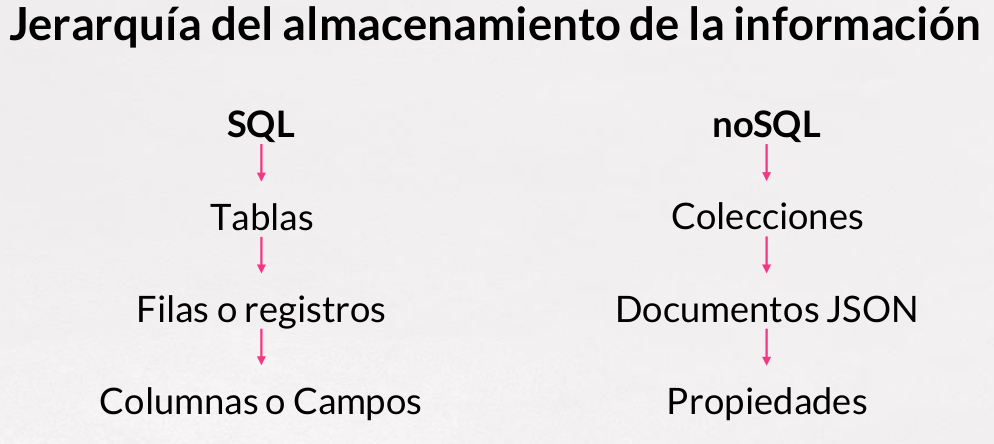
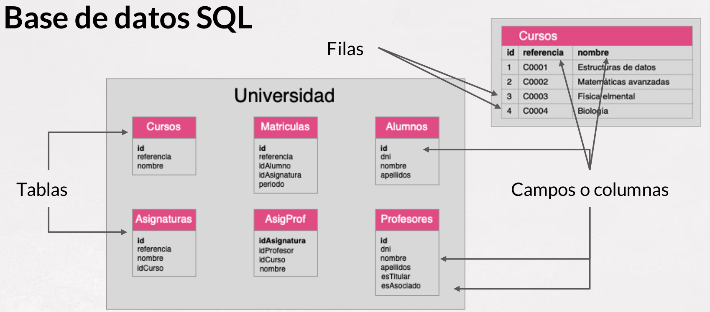
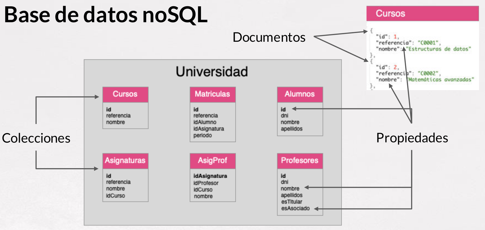

# 2. **MongoDB**

**MongoDB** es una base de datos NoSQL, de **código abierto** y **orientada a documentos**. En lugar de almacenar datos en tablas, como lo hace una base de datos relacional, **MongoDB** almacena datos en documentos similares a *JSON* con un formato llamado ***BSON*** (*Binary JSON*). *BSON* extiende el formato *JSON* para incluir tipos de datos adicionales como fechas y binarios, lo que lo hace más adecuado para representar datos complejos.

[**MongoDB**](http://www.mongodb.com) es una de las bases de datos NoSQL más conocidas. Sigue un modelo de datos documental,

<div align="center">
    
</div>

> Como curiosidad, su nombre viene de la palabra inglesa humongous, que significa gigantesco/enorme.

*MongoDB* **destaca** porque:

- Soporta **esquemas dinámicos**: diferentes documentos de una misma colección pueden tener atributos diferentes.
- Aunque inicialmente tenía un soporte limitado de **joins**, desde la versión 5.2 se pueden realizar incluso entre colecciones particionadas.
- Soporte de **transacciones** sólo a nivel de aplicación. Lo que en un RDMS puede suponer múltiples operaciones, con *MongoDB* se puede hacer en una sola operación al insertar/actualizar todo un documento de una sola vez, pero si queremos crear una transacción entre dos documentos, la gestión la debe realizar el driver.

*MongoDB* se utiliza ampliamente en una variedad de aplicaciones, incluidas aquellas con grandes volúmenes de datos, cargas de trabajo de alta velocidad y requisitos de flexibilidad de esquema. Es especialmente popular en aplicaciones web y móviles, así como en entornos de Big Data y análisis en tiempo real.


## Características de *MongoDB*

Si tuviéramos que resumir a una la principal característica a destacar de *MongoDB*, sin duda esta sería la **velocidad**, que alcanza un **balance perfecto entre rendimiento y funcionalidad** gracias a su sistema de consulta de contenidos. Pero sus características principales no se limitan solo a esto, *MongoDB* cuenta, además, con otras que lo posicionan como el preferido de muchos desarrolladores.

Características principales:

- **Consultas ad hoc**. Con MongoDb podemos realizar todo tipo de consultas. Podemos hacer búsqueda por campos, consultas de rangos y expresiones regulares. Además, estas consultas pueden devolver un campo específico del documento, pero también puede ser una función JavaScript definida por el usuario.
- **Indexación**. El concepto de índices en *MongoDB* es similar al empleado en bases de datos relacionales, con la diferencia de que cualquier campo documentado puede ser indexado y añadir múltiples índices secundarios.
- **Replicación**. Del mismo modo, la replicación es un proceso básico en la gestión de bases de datos. *MongoDB* soporta el tipo de replicación primario-secundario. De este modo, mientras podemos realizar consultas con el primario, el secundario actúa como réplica de datos en solo lectura a modo copia de seguridad con la particularidad de que los nodos secundarios tienen la habilidad de poder elegir un nuevo primario en caso de que el primario actual deje de responder.
- **Balanceo de carga**. Resulta muy interesante cómo *MongoDB* puede escalar la carga de trabajo. *MongoDB* tiene la capacidad de ejecutarse de manera simultánea en múltiples servidores, ofreciendo un balanceo de carga o servicio de replicación de datos, de modo que podemos mantener el sistema funcionando en caso de un fallo del hardware.
- **Almacenamiento de archivos**. Aprovechando la capacidad de *MongoDB* para el balanceo de carga y la replicación de datos, Mongo puede ser utilizado también como un sistema de archivos. Esta funcionalidad, llamada GridFS e incluida en la distribución oficial, permite manipular archivos y contenido.
- **Ejecución de JavaScript del lado del servidor**. *MongoDB* tiene la capacidad de realizar consultas utilizando JavaScript, haciendo que estas sean enviadas directamente a la base de datos para ser ejecutadas.


## Conceptos básicos

Hay una serie de conceptos que conviene conocer antes de entrar en detalle:

- *MongoDB* tienen el mismo concepto de base de datos que un RDMS. Dentro de una instancia de *MongoDB* podemos tener 0 o más bases de datos, actuando cada una como un contenedor de alto nivel.
- Una base de datos tendrá 0 o más colecciones. Una colección es muy similar a lo que entendemos como tabla dentro de un RDMS. *MongoDB* ofrece diferentes tipos de colecciones, desde las normales cuyo tamaño crece conforme lo hace el número de documentos, como las colecciones capped, las cuales tienen un tamaño predefinido y que pueden contener una cierta cantidad de información que se sustituirá por nueva cuando se llene.
- Las colecciones contienen 0 o más documentos, por lo que es similar a una fila o registro de un RDMS.
- Cada documento contiene 0 o más atributos, compuestos de parejas clave/valor. Cada uno de estos documentos no sigue ningún esquema, por lo que dos documentos de una misma colección pueden contener todos los atributos diferentes entre sí.

<div align="center">
    
</div>

Así pues, tenemos que una base de datos va a contener varias colecciones, donde cada colección contendrá un conjunto de documentos. Podemos hacer una correspondencia rápida entre bases de datos Relacionales y NoSQL:

<div align="center">
    
    
</div>

Además, *MongoDB* soporta índices, igual que cualquier RDMS, para acelerar la búsqueda de datos. Al realizar cualquier consulta, se devuelve un cursor, con el cual podemos hacer cosas tales como contar, ordenar, limitar o saltar documentos.


## *BSON*

*MongoDB* almacena los documentos mediante *BSON* ([Binary JSON](https://bsonspec.org/spec.html)).

Repasemos el concepto de **JSON**: *JavaScript Object Notation*
- Formato de texto sencillo para el intercambio de datos.
- Subconjunto de la notación literal de objetos de JavaScript.
- Alternativa a XML como lenguaje de intercambio de datos. Mucho más sencillo de leer y escribir.
- Uso extendido en bases de datos noSQL, entre ellas *JSON*: JavaScript Object Notation
- Ampliamente soportado por multitud de lenguajes de programación.
- Un objeto *JSON* está formado por uno o varios pares string: value (cadena:valor).
- Soporta diferentes tipos de datos como cadenas de texto, números, fecha, hora, valores nulos y booleanos.

<div align="center">
    
</div>

Mediante JavaScript podemos crear objetos que se representan con *JSON*. Internamente, *MongoDB* almacena los documentos mediante *BSON* ([Binary JSON](https://www.mongodb.com/json-and-bson)). Podemos consultar la especificación en la [web oficial de *BSON*](http://BSONSpec.org) 

**BSON** representa un superset de *JSON* ya que:

- Permite almacenar datos en binario
- Incluye un conjunto de tipos de datos no incluidos en *JSON*, como pueden ser ObjectId, Date o BinData.

Podemos consultar todos los tipos que soporta un objeto *BSON* en (http://docs.mongodb.org/manual/reference/bson-types/)[http://docs.mongodb.org/manual/reference/bson-types/]

Un ejemplo de un objeto *BSON* podría ser:

```js
var yo = {
  nombre: "Aitor",
  apellidos: "Medrano",
  fnac: new Date("Oct 3, 1977"),
  hobbies: ["programación", "videojuegos", "baloncesto"],
  casado: true,
  hijos: 2,
  contacto: {
    twitter: "@aitormedrano",
    email: "a.medrano@edu.gva.es"
  },
  fechaCreacion: new Timestamp()
}
```

Los documentos **BSON** tienen las siguientes restricciones:

- No pueden tener un tamaño superior a 16 MB.
- El atributo `_id` queda reservado para la clave primaria.
- Desde *MongoDB* 5.0 los nombres de los campos pueden empezar por `$` y/o contener el `.`, aunque en la medida de lo posible, es recomendable evitar su uso.

Además *MongoDB*:

- No asegura que el orden de los campos se respete.
- Es sensible a los tipos de los datos
- Es sensible a las mayúsculas.

Por lo que estos documentos son distintos:

```js
{"edad": "18"}
{"edad": 18}
{"Edad": 18}
```

Si queremos validar si un documento *JSON* es válido, podemos usar la web [JSONLint Validator and Formatter](http://jsonlint.com/). Hemos de tener en cuenta que sólo valida *JSON* y no *BSON*, por tanto nos dará errores en los tipos de datos propios de *BSON*.

## Bases de datos Relacionales vs *MongoDB*

Aquí tenemos un esquema de los elementos de una base de datos representada tanto por un sistema relacional tradicional, frente a la misma estructura con una base de datos en *MongoDB*

Primero la base de datos relacional

<div align="center">
    
</div>

y ahora la misma representación en *MongoDB*

<div align="center">
    
</div>


