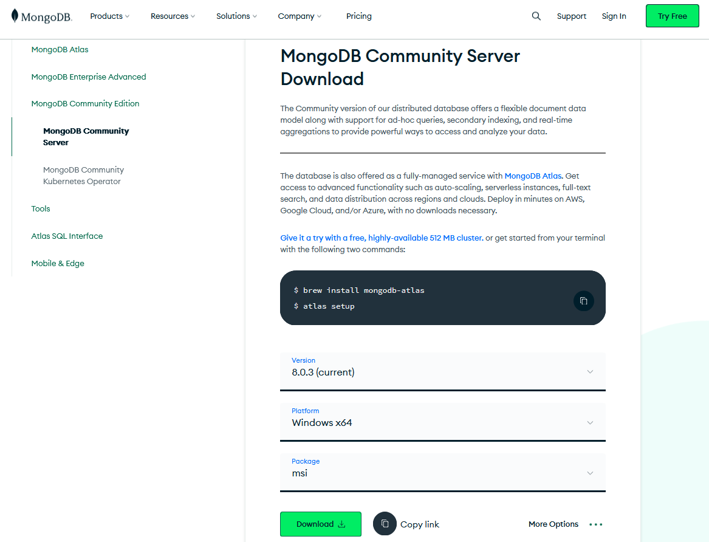
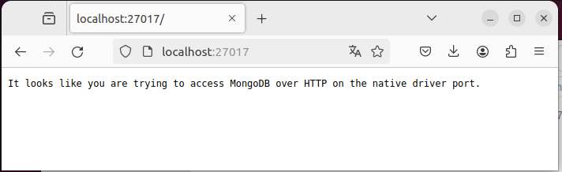
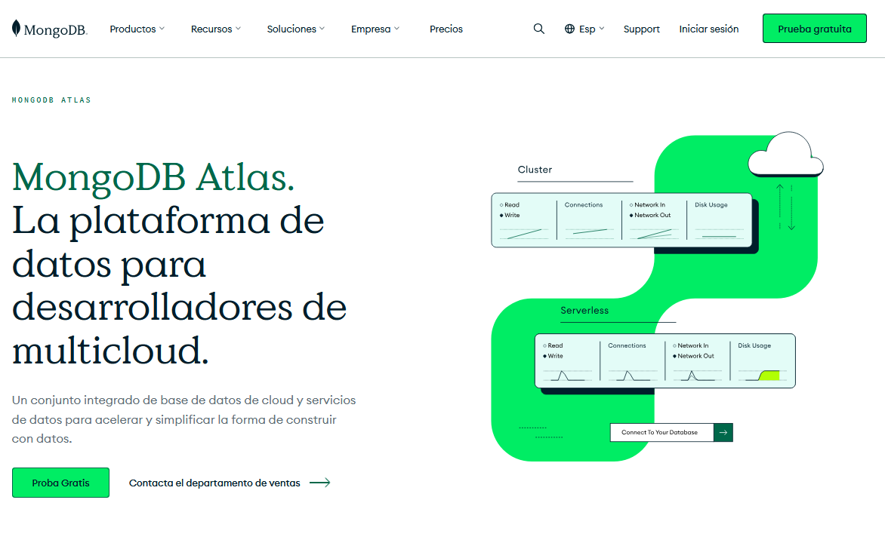
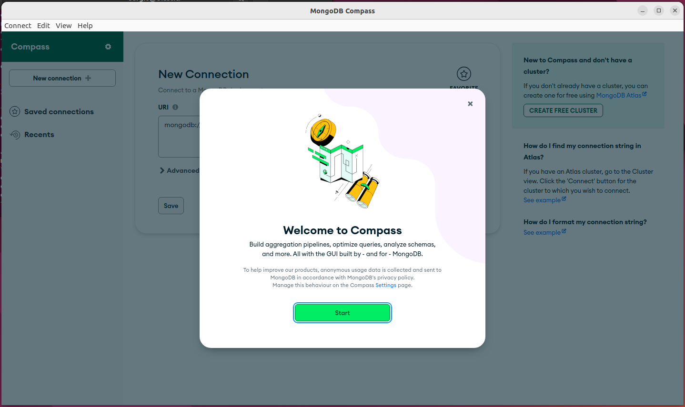
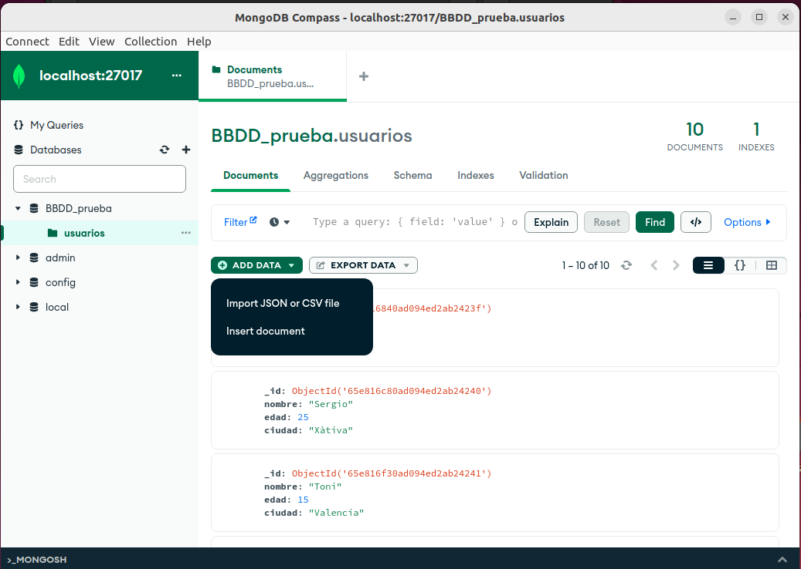

## Instalación de **MongoDB**

En la actualidad, *MongoDB* se como base de datos en tres productos diferentes más un conglomerado de servicios y herramientas que complementas a la base de datos.

<div align="center">
    
</div>

1. **Mongo Atlas**, como plataforma cloud, con una opción gratuita mediante un cluster de 512MB.
2. **MongoDB Enterprise Advanced**, versión de pago con soporte, herramientas avanzadas de monitorización y seguridad, y administración automatizada.
3. **MongoDB Community Edition**, versión gratuita para trabajar on-premise, con versiones para Windows, MacOS y Linux. *Nosotros de momento trabajaremos con esta versión*


### Instalación en sistemas Windows

Para instalar **MongoDB** en un equipo Microsoft Windows, procedemos como siempre.

Vamos a la web de [MongoDB en su sección de descargas (versión Community)](https://www.mongodb.com/try/download/community)

Descargamos e instalamos.

<div align="center">
    
</div>


**Nota:**. Al realizar esta instalación al mismo tiempo instalamos [MongoDB Compass](https://www.mongodb.com/products/tools/compass) que veremos más adelante. Se trata de una interface de acceso s MongoDB

### Instalación en Ubuntu

Para la instalación de **MongoDB Community Edition** en un sistema Ubuntu vamos a proceder tal y como se espedifica en la propia web de **mongodb**. [Install *MongoDB* Community Edition](https://www.mongodb.com/docs/manual/tutorial/install-mongodb-on-ubuntu/#install-mongodb-community-edition) 

Realizaremos los siguientes pasos:

```bash
# Requisitos previos
sudo apt-get install gnupg curl                   # Requisitos previos

# Importar claves públicas GPG de MongoDB
curl -fsSL https://www.mongodb.org/static/pgp/server-8.0.asc | \
   sudo gpg -o /usr/share/keyrings/mongodb-server-8.0.gpg \
   --dearmor

# añadir las fuentes
echo "deb [ arch=amd64,arm64 signed-by=/usr/share/keyrings/mongodb-server-8.0.gpg ] https://repo.mongodb.org/apt/ubuntu noble/mongodb-org/8.0 multiverse" | sudo tee /etc/apt/sources.list.d/mongodb-org-8.0.list

# recargar paquetes
sudo apt-get update

# e instalar
sudo apt-get install -y mongodb-org
```

Con esto ya tenemos *MongoDB* instalado en nuestro sistema.

Ahora nos falta ponerlo en marcha, para ello habilitamos e iniciamos el servicio

```bash
# recargamos los nuevos servicios
sudo systemctl daemon-reload

# Habilitamos el servicios (esto es opcional, solo si queremos que se inicie al arrancar el equipo)
sudo systemctl enable mongod

# Iniciamos el servicio
sudo systemctl start mongod

# Comprobamos que el servicio se ha iniciado correctamente
sudo systemctl status mongod
```
<div align="center">
    
</div>

Mediante el siguiente comando también verificamos que esta activa y su versión. 

```bash
mongod --version                                  # Comprobamos la versión
```

<div align="center">
    
</div>


> **Nota**: *MongoDB* también lo podemos instalar descargando el paquete .deb desde la web de *MongoDB*, pero suele dar mas problemas que con la instalación presentada


### Configurando **MongoDB** en los ***Contenedores de Proxmox***

Para poder utilizar **MongoDB** en los contenedores, necesitamos realizar las siguientes acciones.

- En primer lugar, es adecuado asignar una IP estática a cada uno de los contenedores, o al menos conocer la IP del contenedor para poder conectar con el  

- En segundo lubar, necesitamos configurar MongoDB para permitir el acceso desde un equipo externo. Esto también se debe hacer en la instalación en Ubuntu si quieremos acceder desde otro equipo.

Para ello, editamos el fichero de configuración `/etc/mongod.conf` 

```bash
sudo nano /etc/mongod.conf
```

Ponemos la IP de nuestro equipo en el apartado correspondiente (`net`)

```bash
# network interfaces
net:
  port: 27017
  bindIp: 127.0.0.1,10.20.90.150
```

- Reiniciamos el servicio

```bash
sudo systemctl restart mongod
```

## Probando la instalación

Independientemente de nuestro sistema operativo, por defecto, el demonio se lanza sobre el puerto 27017. Una vez instalado, si accedemos a [http://localhost:27017](http://localhost:27017) podremos ver que nos indica cómo estamos intentando acceder mediante HTTP a *MongoDB* mediante el puerto reservado al driver nativo.

<div align="center">
    
</div>

En vez de instalarlo como un servicio en nuestra máquina, a día de hoy, es mucho más cómodo hacer uso de contenedores Docker o utilizar una solución cloud, aunque nosotros por simplicidad, de momento, realizaremos una instalación tradicional.


## Mongo Atlas

Si por el motivo que sea no deseamos instalar MongoDB, si no que queremos utilizar su versión cloud, tenemos **Mongo Atlas**

<div align="center">
    
</div>

La versión de **Mongo Atlas** nos ofrece de manera gratuita un cluster compartido de servidores con 3 nodos y 512 MB para datos. Si queremos una solución serverless o un servidor dedicado, ya tendremos que pasar por caja.

Obviamente para hacer uso de esta versión, necesitas registrarte en la web de **MongoDB**

## Herramientas visuales para interactuar con *MongoDB* 

Hemos visto cómo interactuar con *MongoDB* desde la consola que nos ofrece la base de datos, pero para interactuar de una forma más flexible e intuitiva existen herramientas visuales que nos facilitan el trabajo diario con *MongoDB*

### *MongoDB* Compass

Una de ellas es *MongoDB* Compass, que facilita la exploración y manipulación de los datos. De una manera flexible e intuitiva, Compass ofrece visualizaciones detalladas de los esquemas, métricas de rendimiento en tiempo real así como herramientas para la creación de consultas.

Existen tres versiones de Compass, una completa con todas las características, una de sólo lectura sin posibilidad de insertar, modificar o eliminar datos (perfecta para analítica de datos) y una última versión isolated que solo permite la conexión a una instancia local.

Enlace a la documentación oficial de *MongoDB* Compass: [What is *MongoDB* Compass?](https://www.mongodb.com/docs/compass/current/)

#### Instalación

Siguiendo los pasos ofrecidos por la propia web de *MongoDB*, para la instalación de *MongoDB* Compass en Ubuntu seguimos los siguientes pasos:

```bash
# Download *MongoDB* Compass
wget https://downloads.mongodb.com/compass/mongodb-compass_1.40.4_amd64.deb

# Install *MongoDB* Compass
sudo dpkg -i mongodb-compass_1.40.4_amd64.deb

# Start *MongoDB* Compass
mongodb-compass
```

Si hacemos caso a lo que nos dicen en la guía, directamente instalamos la última versión estable.

<div align="center">
    
</div>

#### Trabajando con *MongoDB* Compass

Al iniciar la aplicación, la primera vez nos ofrece conectarnos a la base de datos local. También nos podemos conectar a una base de datos remota e incluso a [Mongo Atlas](https://www.mongodb.com/es/atlas), que como se comentó es la base de datos que ofrece *MongoDB* en la nube.

Una vez conectados a la base de datos, vemos todas las bases de datos exitentes. En la parte inferior tenemos una consola donde podemos actuar de la misma forma que lo hicimos anteriormente.

<div align="center">
    
</div>

Dentro de una base de datos, podemos acceder a las colecciones, listar los documentos, y realizar todo tipo de operaciones sobre los mismos:

<div align="center">
    
</div>

Así como operaciones específicas sobre documentos en concreto. Si nos colocamos con el ratón sobre un documento aparecen cuatro opciones, para *editar*, *copiar,*, *duplicar* y *borrar* el documento. Haciendo doble click, también lo editamos.

Tenemos varias opciones sobre la base de datos, incluso podemos hacer consultas.

<div align="center">
    
</div>

En la imagen:
1. Dentro de una colección, seleccionamos la pestaña de `schema`
2. Introducimos el filtro a buscar
3. Obtenemos el detalle de los datos de los documentos obtenidos
4. Tenemos un histórico de todas las búsquedas realizadas


### *MongoDB* for VSCode

También podemos utilizar la extensión que lleva VSCode para trabajar con *MongoDB*.

Para su **instalación**

Si no disponemos de VSCode:
- podemos instalarlo siguiendo los pasos de la propia web de Microsoft: [Visual Studio Code on Linux](https://code.visualstudio.com/docs/setup/linux#_debian-and-ubuntu-based-distributions)
- si tenemos la versión completa de Ubuntu, la podemos instalar desde el gestor de aplicaciones:

<div align="center">
    
    
</div>

Una vez instalado VSCode, instalamos la extensión de *MongoDB* for VS Code, aqui seguimos los pasos de la web oficial donde tenemos cómo instalar y configurar la conexión: [VSCode: Working with MongoDB](https://code.visualstudio.com/docs/azure/mongodb). Para la conexión, pulsamos sobre el botón de *Advanced* y la conexión es sencilla

<div align="center">
        
    
</div>

Una vez conectados, podremos recorrer las colecciones con los datos así como utilizar un *playground* para interactuar de manera similar al shell:

<div align="center">
        
    
</div>

Realmente, esta extensión este pensada para trabajar con opciones avanzadas, como crear índices, generar código en lenguajes como *javascript*, *python* o cualquier otro para realizar todo tipo de operaciones en *MongoDB*, o crear variables con datos y estos utilizarlos en nuestras operaciones. Para más información en la web de la extension: [MongoDB for VS Code. *MongoDB* Without Leaving Your IDE](https://www.mongodb.com/products/tools/vs-code)

