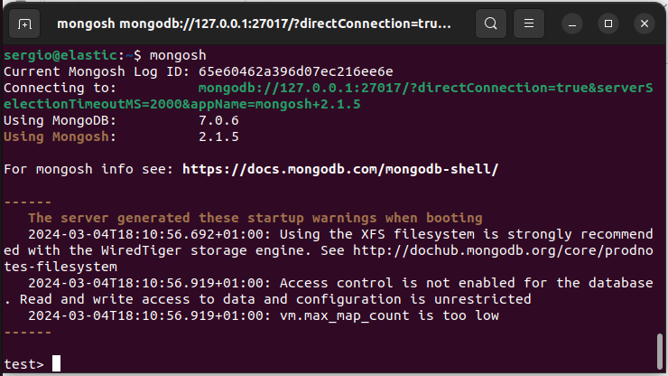
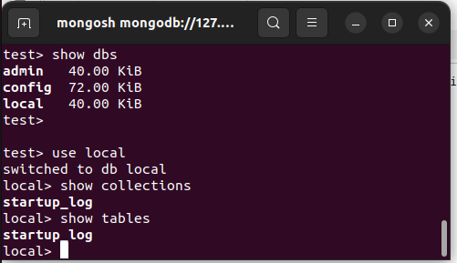
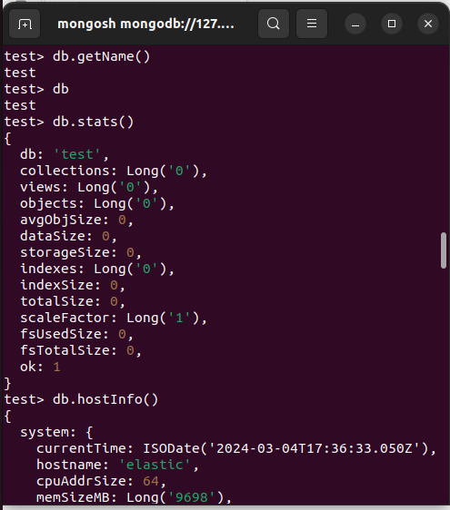
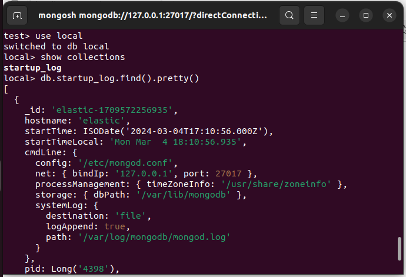
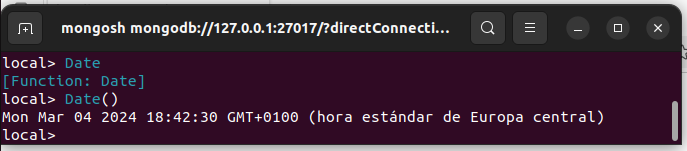
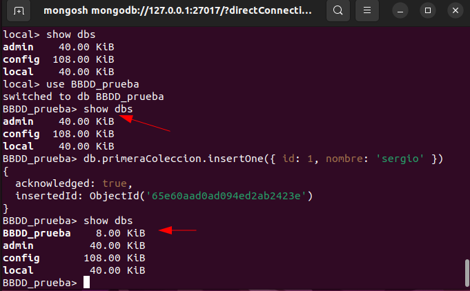
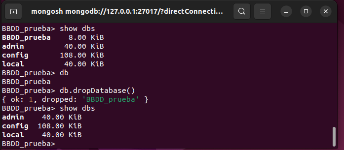

# 5. Primeros pasos con *MongoDB*

Una vez instalada la base de datos, vamos a interactuar desde su propia consola.

## Trabajando con *MongoDB* desde la consola

Para acceder a la consola de *MongoDB* escribimos:

```bash
mongosh
```
<div align="center">
    
</div>

Algunas de las operaciones básicas que podemos realizar son : 

- Salir de la consola (`quit()` o pulsando Ctrl+C)
- Limpiar la consola (Ctrl+L)
- Listar las bases de datos (`show dbs`)
- Cambiarse de base de datos (`use <dbname>`)
- Listar las colecciones de una base de datos (`show collections` / `show tables`)

<div align="center">
    
</div>

- Mostrar el nombre de la base de datos (`db.getName()` o `db`)
- Listar metadata sobre una base de datos (`db.stats()`)
- Solicitar ayuda sobre comandos (`db.help()`)
- Mostrar información sobre el servidor (`db.hostInfo()`)
- Mostrar fecha y hora del sistema (`Date()`)
- Dar formato *JSON* (`db.<collectionName>.find().pretty()`)

<div align="center">
    
</div>

Observar que al poner `.pretty()` al final, hace que la salida tenga un formato fácilmente reconocible, aunque hay ocasiones que la salida por defecto ya viene con esta método.

<div align="center">
    
</div>

Observa también que hay un diferencia entre invocar la función con los paréntesis `()`:

<div align="center">
    
</div>

## Creación y gestión de Bases de Datos

### Creación : `use`

El comando para crear una base de datos es el mismo que visto anteriormente para cambiar de base de datos: `use`

Así pues si intentamos entrar en una base de datos que no existe, directamente la prueba

Hasta que no insertes al menos un documento en una de sus colecciones, no estará disponible. Esto lo podemos hacer en el siguiente ejemplo:

<div align="center">
    
</div>

Todo esto es debido a que *MongoDB* planifica la existencia de una base de datos, pero hasta que no tenga su primer dato, no va a designar ningún tipo de recursos a la misma. En la captura anterior, se ve que ya le ha asignado 8 KiB a nuestra primera base de datos porque ya tiene algún dato.

Por otra parte, para la creación de una colección e inclusión de un documento en concreto, observar que simplemente al insertar el documento, si la colección no existe, la crea directamente, de la misma forma que ha hecho con la base de datos.

Más adelante ya veremos con más detenimiento las diferentes forma de insertar registro en un tabla (colección), de momento hemos usando el comando:

```js
db.primeraColeccion.insertOne({ id: 1, nombre: 'sergio' })
```

### Eliminación de base de datos: `db.dropDatabase()`

Para eliminar una base de datos, en primer lugar debemos estar ubicados dentro de la propia base de datos a eliminar y ahí ejecutamos el comando 

```js
db.dropDatabase()
```

Podemos hacer uso de los comandos `use` y `db` para pasar ubicarnos en una base de datos y comprobar que efectivamente lo estamos, aunque en el prompt de la propia shell de *MongoDB* directamente ya nos dice que estamos ahí.

<div align="center">
    
</div>


### *MongoDB* Database Tools

Además del propio servidor de *MongoDB* y el cliente para conectarse a él, *MongoDB* ofrece un conjunto de herramientas para interactuar con las bases de datos, permitiendo crear y restaurar copias de seguridad.

Si estamos interesados en introducir o exportar una colección de datos mediante *JSON*, podemos emplear los comandos `mongoimport` y `mongoexport`:

```bash
mongoimport -d nombreBaseDatos -c coleccion –-file nombreFichero.json
mongoexport -d nombreBaseDatos -c coleccion nombreFichero.json
```

Estas herramientas interactúan con datos *JSON* y no sobre toda la base de datos.

Un caso particular y muy común es importar datos que se encuentran en formato *CSV/TSV*. Para ello, emplearemos el parámetro -`-type csv`:

```bash
mongoimport --type tsv -d test -c poblacion --headerline --drop poblacionEspanya2013.tsv
```

Donde
  - `--type` : indica el tipo de fichero; csv o tsv
  - `-d` o `--db`: indica la base de datos
  - `-c` o `--collection` : indica la colección
  - `--headerline`: en un csv o tsv indica que la primera línea contiene los nombres de los campos
  - `--drop`: elimina la colección si existe antes de la importación del fichero

Mas información en el [Manual de MongoDB: mongoimport](https://www.mongodb.com/docs/database-tools/mongoimport/)

En vez de realizar un *export*, es más conveniente realizar un ***backup*** en binario mediante `mongodump`, el cual genera ficheros *BSON*. Estos archivos posteriormente se restauran mediante `mongorestore`:

```bash
mongodump -d nombreBaseDatos nombreFichero.bson
mongorestore -d nombreBaseDatos nombreFichero.bson
```

Si necesitamos transformar un fichero *BSON* a *JSON* (de binario a texto), tenemos el comando `bsondump`:

```bash
bsondump file.bson > file.json
```

Más información sobre copias de seguridad en la documentación oficial de [MongoDB: *MongoDB* Backup Methods ](https://www.mongodb.com/docs/manual/core/backups/).

Para poder trabajar con *MongoDB* desde cualquier aplicación necesitamos un driver. *MongoDB* ofrece drivers oficiales para casi todos los lenguajes de programación actuales. En una sesión posterior trabajaremos con PyMongo.

En cuanto a la **monitorización**, tanto `mongostat` como `mongotop` permiten visualizar el estado del servidor *MongoDB*, así como algunas estadísticas sobre su rendimiento. Si trabajamos con *MongoAtlas* estas herramientas están integradas en las diferentes herramientas de monitorización de la plataforma.

En versiones anteriores, una herramienta de terceros bastante utilizada era *RoboMongo* / *Robo3T* / *Studio3T* el cual extiende el shell y ofrece un IDE más amigable. A días de hoy, *MongoDB* tiene su propio IDE conocido como [MongoDB Compass](#71-mongodb-compass) que veremos más adelante.

## Tipos de datos 

Aquí tienes una lista de algunos tipos de datos comunes en *MongoDB*, junto con ejemplos de cómo se representan en formato de tabla:

| Tipo de Datos  | Descripción                             | Ejemplo                                |
|----------------|-----------------------------------------|----------------------------------------|
| String         | Cadena de texto                         | "Hello World"                          |
| Number         | Número                                  | 42                                     |
| Boolean        | Valor booleano (true/false)             | true                                   |
| Date           | Fecha y hora                            | ISODate("2024-03-01T12:00:00.000Z")   |
| Array          | Array de valores                        | [1, 2, 3]                              |
| Object         | Objeto o documento anidado              | {"nombre": "Juan", "edad": 30}        |
| ObjectId       | Identificador único de documento        | ObjectId("61e4c3055b17967d02a9c3d7")  |
| Null           | Valor nulo                              | null                                   |
| BinData             | Datos binarios                              | BinData(0, "ABC123==")                     |
| Regular Expressions | Expresiones regulares                       | /pattern/g                                 |

Recuerda que *MongoDB* es una base de datos NoSQL orientada a documentos, por lo que no tiene una estructura de tabla como las bases de datos relacionales. En *MongoDB*, los datos se almacenan en documentos *BSON* (Binary *JSON*), que pueden contener campos con diferentes tipos de datos, incluidos los mencionados anteriormente.

Es importante destacar que en *MongoDB*, los datos binarios y las expresiones regulares se representan de manera especial. Los datos binarios se representan mediante el tipo `BinData`, que incluye un tipo y una cadena de datos codificados en *base64*. Las expresiones regulares se representan utilizando el formato `/pattern/flags`, donde `pattern` es el patrón de la expresión regular y `flags` son los modificadores de la expresión regular, como `i` para ignorar mayúsculas y minúsculas o `g` para realizar una búsqueda global.


Aquí tienes un ejemplo de cómo se podría representar un documento en *MongoDB* utilizando algunos de estos tipos de datos:

```js
{
  "_id": ObjectId("61e4c3055b17967d02a9c3d7"),
  "nombre": "Juan",
  "edad": 30,
  "activo": true,
  "intereses": ["programación", "música", "viajes"],
  "ubicacion": {
    "ciudad": "Barcelona",
    "pais": "España"
  },
  "fechaRegistro": ISODate("2024-03-01T12:00:00.000Z"),
  "comentarios": [
    {
      "usuario": "Ana",
      "texto": "¡Hola Juan!"
    },
    {
      "usuario": "Carlos",
      "texto": "Saludos desde Xàtiva."
    }
  ]
}
```

<div align="center">
    
</div>


En este ejemplo, que ya hemos visto previamente para ilustrar qué es un *BSON*, el documento representa un usuario con campos como nombre, edad, activo, intereses, ubicación, fecha de registro y comentarios. Cada campo tiene un tipo de datos diferente, como string, number, boolean, array, object, date, etc.

Más información sobre tipos de datos en [tutorialspoint *MongoDB*  - Datatypes](https://www.tutorialspoint.com/mongodb/mongodb_datatype.htm)

