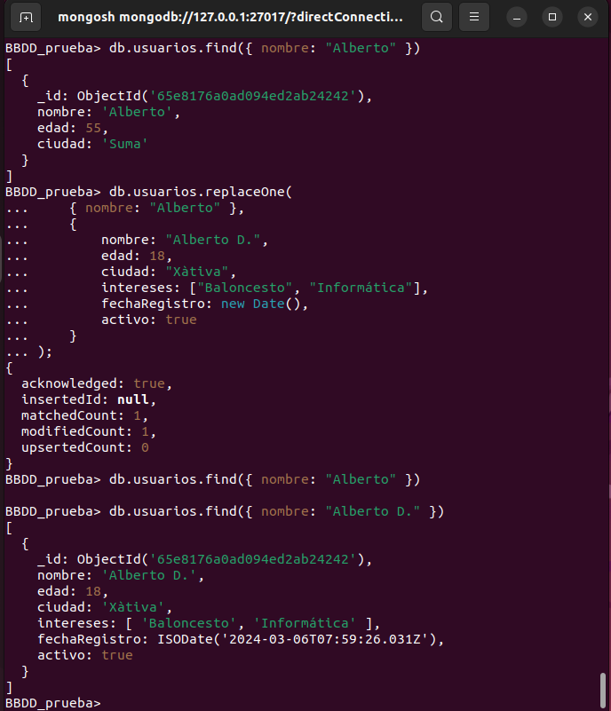

# 6. Operaciones con datos CRUD

En *MongoDB* , las operaciones **CRUD** (*Crear*, *Leer*, *Actualizar*, *Eliminar*) se realizan utilizando métodos específicos. Aquí te muestro cómo realizar cada una de estas operaciones.

Antes de comenzar a trabajar, debemos entrar en una de las bases de datos con `use` y en todo momento podemos ver las colecciones que tenemos en esta base de datos con `use collections` 

## Insertar :

Para insertar documentos en una colección, se utiliza el método `insertOne()` o `insertMany()`.

### `insertOne()`

- `db.collectionName.insertOne(<json>);`: Inserta un solo documento

<figure markdown="span" align="center">
  { width="75%"  }
  <figcaption>MongoDB. Inserción en colección.</figcaption>
</figure>

Ejemplos

 - ^^Insertar un solo documento en la colección 'usuarios'^^

```javascript
db.usuarios.insertOne({
    nombre: "Juan",
    edad: 30,
    ciudad: "Barcelona"
});
```

- ^^En un única línea, y con comillas dobles, también...^^

```javascript
db.usuarios.insertOne({ nombre: "Toni", edad: 15, ciudad: "Valencia"});
```

- ^^Insertar un solo documento en la colección 'usuarios'^^

```javascript
db.usuarios.insertOne({
    nombre: "Juan",
    edad: 30,
    ciudad: "Barcelona",
    intereses: ["fútbol", "música"],
    direccion: { calle: "Calle Mayor", numero: 123 },
    fechaRegistro: new Date(),
    activo: true
});
```

- ^^Insertar un documento con la fecha actual. Ojo con el último campo^^

```javascript
db.usuarios.insertOne({
    nombre: "Dorotea",
    fecha: new Date(),
    lugar: "Xàtiva"
});
```

- ^^Insertar un documento con una fecha específica^^  

Los campos antes no estaban entre comillas y en este ejemplo si lo estan; es totalmente indiferente. Pero si debemos tener en cuenta que es *case-sensitive* (Mayúsculas/Minúsculas) es importante y adcemás también cambia si ponemos los datos númericos entre comillas o no, ya que se convierten en texto

```javascript
db.usuarios.insertOne({
    "nombre": "Filiberto",
    "edad" : "33",
    "fechaNacimiento": new Date("2004-03-15"),
    "ciudad": "Alacant"
});
```

Cada vez que hacemos una inserción, si es correcta, nos devuelve el resultado del con el siguiente formato

```js
{
  acknowledged: true,
  insertedId: ObjectId('65e818360ad094ed2ab24245')
}
```

### `insertMany()`

- `db.collectionName.insertMany(<json>);`. Inserción de varios elementos.

Como se trata de una inserción de un conjunto de documentos, lo que hacemos en pasar un **array** y esto se hace mediante el uso de ***corchetes*** : `[]`.

Ejemplos: 

- ^^Insertar varios documentos en la colección 'usuarios'^^
```javascript
db.usuarios.insertMany([
    { nombre: "Ana", edad: 25, ciudad: "Madrid" },
    { nombre: "Carlos", edad: 35, ciudad: "Valencia" }
]);
```

- ^^Insertar varios documentos en la colección 'usuarios'^^
```javascript
db.usuarios.insertMany([
    { nombre: "Ana", edad: 25, ciudad: "Madrid", intereses: ["viajes"], fechaRegistro: new Date(), activo: false },
    { nombre: "Carlos", edad: 35, ciudad: "Valencia", intereses: ["lectura"], fechaRegistro: new Date(), activo: true }
]);
```

Observar cómo se trabaja con las fechas

## Leer/Consultas:

Uno de los aspectos más interesantes de las bases de datos es la capacidad para realizar consultas, por lo que ahora vamos a ver de forma muy breve como leer datos, pero más adelante profundizaremos en la realización de consultas más elaboradas.

### `find()`
Para leer datos de una colección, se utiliza el método `find()`.

- ^^Leer todos los documentos de la colección 'usuarios'^^
```javascript
db.usuarios.find();
```

- ^^Leer todos los documentos de la colección 'usuarios' y formatear la salida json^^
```javascript
db.usuarios.find().pretty();
```

!!! note "funcion `pretty()`"
    La función `pretty()` en MongoDB sigue siendo efectiva, pero su uso ha cambiado con las versiones más recientes. En *mongosh* (la nueva shell de MongoDB), `pretty()` no altera el formato de salida, mientras que en la *shell legacy* (mongo shell), sí lo hacía, mostrando los resultados de manera más legible


- ^^Leer documentos que coincidan con un criterio específico^^
```javascript
db.usuarios.find({ ciudad: "Barcelona" });
```

- ^^Leer documentos que coincidan con un criterio específico (por ejemplo, ciudad igual a 'Barcelona' y activo igual a true)^^
```javascript
db.usuarios.find({ ciudad: "Barcelona", activo: true });
```

Podemos especificar los campos que queremos recuperar en la consulta: 

- ^^Leer documentos con proyección (seleccionar campos específicos)^^
```javascript
db.usuarios.find({}, { nombre: 1, edad: 1 });
```

El formato a utilizar es `NombreDeCampo: 1`, o sea, escribimos el nombre del campo, seguido de dos puntos y un uno. 

Lógicamente si ponemos un **1**, significa que queremos ver el campo, y por lo tanto si ponemos un **0**, significa que no queremos que se muestre el campo, pero esto solo funciona con el campo *objetctID* (***_id***)

- ^^Leer documentos con proyección (seleccionar campos específicos)^^
```javascript
db.usuarios.find({}, { nombre: 1, edad: 1, _id: 0 });
```

- ^^Leer todos los eventos que ocurrieron después de una fecha específica^^
```javascript
db.eventos.find({ fecha: { $gt: new Date("2024-01-01") } });
```

- ^^Leer eventos que ocurrieron en un rango de fechas^^
```javascript
db.eventos.find({ fecha: { $gte: new Date("2024-01-01"), $lte: new Date("2024-12-31") } });
```

!!! Nota

    No profundizamos más en las búsquedas porque más adelante dedicaremos un punto completo a explicar las búsquedas en más profundidad.

## Actualizar:

Para actualizar documentos en una colección, se utiliza el método `updateOne()` o `updateMany()`.

### `updateOne()`

- `db.collection.updateOne(<filter>, <update>)`

El método `updateOne()` se utiliza para actualizar un solo documento que coincida con un criterio específico. Si hay varios documentos que coinciden con el criterio, solo se actualizará el primero que se encuentre.

En la clausula de actualización tenemos el comando `$set`. Además debemos tener en cuenta que tanto el `<filter>` como la `<update>` son json por lo que deben estar comprendidos entre corchetes:

```js
db.collection.updateOne({}, {$set:{}});
```

Veamos algunos ejemplos

- ^^Ejemplo de `updateOne()`^^
```javascript
db.usuarios.updateOne(
    { nombre: "Juan" },
    { $set: { edad: 31 } }
);
```

- ^^Cambiamos más de un valor^^
```javascript
db.usuarios.updateOne(
    { nombre: "Juan" },
    { $set: { edad: 31, ciudad: 'Albacete' } }
);
```

- ^^Actualizar la fecha de un evento específico^^
```javascript
db.usuarios.updateOne(
    { nombre: "Alberto" },
    { $set: { fechaRegistro: new Date("2024-03-20") } }
);
```

En el primer ejemplo, se actualizará el primer documento de la colección "usuarios" que tenga el campo `nombre` igual a "Juan". Si hay varios documentos con ese nombre, solo se actualizará uno.

Una vez realizada la actualización, *MongoDB* avisa: 

```js
{
  acknowledged: true,
  insertedId: null,
  matchedCount: 1,
  modifiedCount: 1,
  upsertedCount: 0
}
```

### `updateMany()`

- `db.collection.updateMany(<filter>, <update)`

Por otro lado, el método `updateMany()` se utiliza para actualizar múltiples documentos que coincidan con un criterio específico. Todos los documentos que cumplan el criterio serán actualizados.

- ^^Ejemplo de `updateMany()`^^
```javascript
db.usuarios.updateMany(
    { ciudad: "Játiva" },
    { $set: { ciudad: "Xàtiva" } }
);
```

En este ejemplo, se actualizarán todos los documentos de la colección "usuarios" que tengan el campo `ciudad` igual a "Játiva", estableciendo su valor a "Xàtiva".

O sea, `updateOne()` es útil cuando solo quieres actualizar un único documento, mientras que `updateMany()` es útil cuando necesitas actualizar múltiples documentos que cumplan un criterio específico.


Además de establecer un valor en una actualización, tenemos otras opciones para las modificaciones a aplicar. Utiliza operadores como:  
- `$set`: Para establecer un nuevo valor.  
- `$unset`: Para eliminar un campo.  
- `$inc`: Para incrementar un valor numérico.  
- `$push`: Para agregar un elemento a un array.  

- ^^En el siguiente ejemplo, incrementamos un año la edad de los usuarios con un determinado nombre.^^

```javascript
db.usuarios.updateMany(
    { nombre : "Alberto" },
    { $inc: { edad: 1 } }
);
```


### `replaceOne()`

- `db.collection.replaceOne(<filter>, <update>)`

Reemplazo completo de un documento. En este caso, al reemplazar el documento que encontramos por una nuevo, no necesitamos el comando `$set`

- ^^Ejemplo donde reemplaza el primer registro qe encuentra con el filtro aplicado^^
```js
db.usuarios.replaceOne(
    { nombre: "Alberto" },
    {     
        nombre: "Alberto D.",
        edad: 18,
        ciudad: "Xàtiva",
        intereses: ["Baloncesto", "Informática"],
        fechaRegistro: new Date(),
        activo: true 
    }
);
```

En este caso, vamos a ver su ejecución, donde veremos incluso que al cambiar el nombre, este campo también cambia aunque se el utilizado para hacer la búsqueda:

<div align="center">
    
</div>

## Eliminar:

Para eliminar documentos de una colección, se utiliza el método `deleteOne()` o `deleteMany()`.

En *MongoDB*, tanto `deleteOne()` como `deleteMany()` son métodos utilizados para eliminar documentos de una colección. Aquí tienes las diferencias entre ellos:

### `deleteOne()`

El método `deleteOne()` se utiliza para eliminar un solo documento que coincida con un criterio específico. **Si hay varios documentos** que coinciden con el criterio, **solo se eliminará el primero** que se encuentre.

- ^^Ejemplo de `deleteOne()`^^
```javascript
db.usuarios.deleteOne({ nombre: "Juan" });
```

En este ejemplo, se eliminará el primer documento de la colección "usuarios" que tenga el campo `nombre` igual a "Juan". Si hay varios documentos con ese nombre, solo se eliminará uno.

### `deleteMany()`

Por otro lado, el método `deleteMany()` se utiliza para eliminar varios documentos que coincidan con un criterio específico. Todos los documentos que cumplan el criterio serán eliminados.

- ^^Ejemplo de `deleteMany()`^^
```javascript
db.usuarios.deleteMany({ activo: false });
```

En este ejemplo, se eliminarán todos los documentos de la colección "usuarios" que tengan el campo `activo` igual a false.

Otros ejemplos

- ^^Eliminar varios documentos que cumplan el criterio especificado^^
```javascript
db.usuarios.deleteMany({ ciudad: "Xàtiva" });
```

- ^^Eliminar eventos que ocurrieron antes de una fecha específica^^
```javascript
db.eventos.deleteMany({ fecha: { $lt: new Date("2024-03-01") } });
```

!!! danger "Cuidado"
    Como siempre debemos tener cuidad a la hora de borrar, de echo si hacemos 

    ```js
    db.usuarios.deleteMany({});
    ```
    Nos borrará **todos** los documentos de la colección.

!!! Nota

    Siempre se debe pasar un json dentro de la condición, o sea, dentro de los paréntesis deben haber llaves:

    ```js
    db.usuarios.deleteMany();     //error
    db.usuarios.deleteMany({});   //correcto: json vacío
    ```

Ahora que ya tenemos más herramientas y hemos visto las operaciones básicas de *MongoDB* en la siguiente sección vamos a profundizar sobre las consultas de los datos, aunque ya las hemos visto brevemente con anterioridad.

