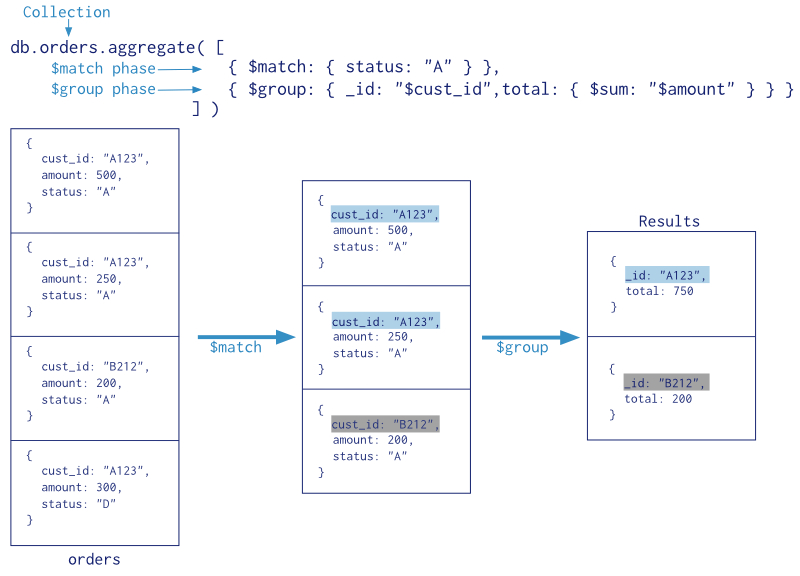
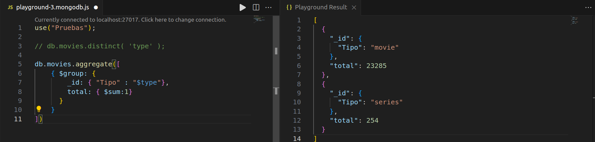
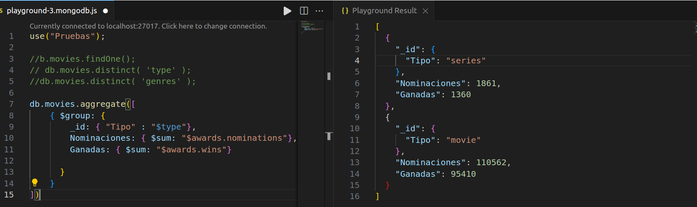
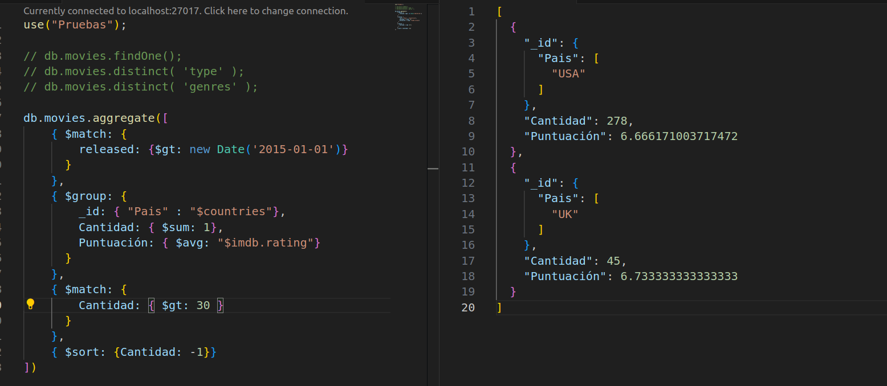
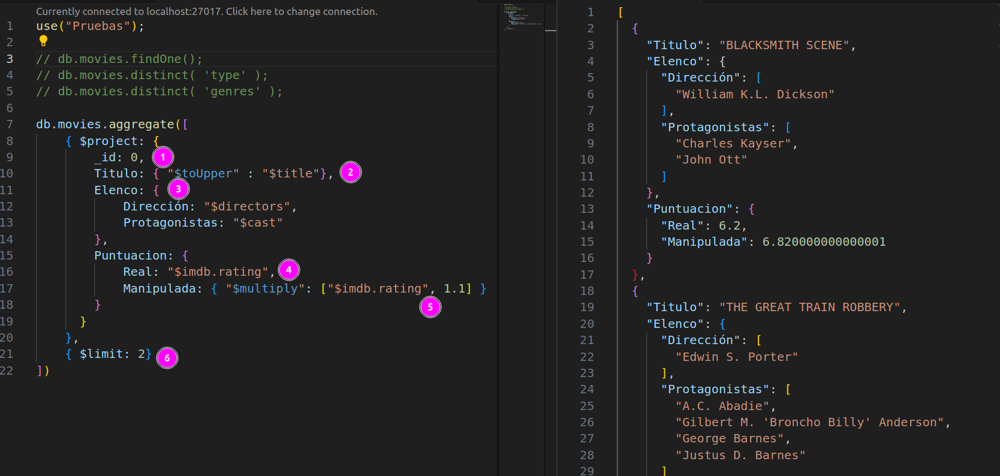

# 7. Operaciones con datos: Consultas y métodos

Ahora que ya tenemos más herramientas y hemos visto las operaciones básicas de *MongoDB* vamos a profundizar sobre las consultas de los datos, aunque ya las hemos visto brevemente con anterioridad.

Aprovechamos para introducir una base de datos con una colección con datos de prueba. En el siguiente [enlace](https://www.w3resource.com/mongodb-exercises/mongodb-sample-dataset/sample_mflix/movies.zip) tenemos una base de datos de películas que podemos introducir en *MongoDB* por ejemplo usando en *MongoDB* Compass. Para ello creamos una base de datos llamada **consultas** e importamos el fichero descargado.

El comando básico es `.find()`

```js
db.collection.find()            // devuelve todos los documentos
db.collection.find(<filter>)    // devuelve los documentos que cumplen el filtro
```

## Operadores *MongoDB*

Antes de continuar, en la siguiente tabla esta el listado de los principales operadores utilizados en consultas *MongoDB* para la construcción de los filtros:

| Operador    | Descripción                                  | Ejemplo                                   |
|-------------|----------------------------------------------|-------------------------------------------|
| `$eq`       | Igualdad                                     | `db.collection.find({campo: {$eq: valor}})` |
| `$ne`       | No igual                                     | `db.collection.find({campo: {$ne: valor}})` |
| `$gt`       | Mayor que                                    | `db.collection.find({campo: {$gt: valor}})` |
| `$gte`      | Mayor o igual que                            | `db.collection.find({campo: {$gte: valor}})` |
| `$lt`       | Menor que                                    | `db.collection.find({campo: {$lt: valor}})` |
| `$lte`      | Menor o igual que                            | `db.collection.find({campo: {$lte: valor}})` |
| `$in`       | Igual a cualquiera de los valores en un array | `db.collection.find({campo: {$in: [valor1, valor2]}})` |
| `$nin`      | No igual a ninguno de los valores en un array| `db.collection.find({campo: {$nin: [valor1, valor2]}})` |
| `$exists`   | Verifica si el campo existe                 | `db.collection.find({campo: {$exists: true/false}})` |
| `$type`     | Verifica el tipo de datos del campo         | `db.collection.find({campo: {$type: tipo}})` |
| `$regex`    | Realiza una búsqueda de expresión regular   | `db.collection.find({campo: {$regex: /patrón/}})` |
| `$or`       | Realiza una disyunción lógica               | `db.collection.find({$or: [{condición1}, {condición2}]})` |
| `$and`      | Realiza una conjunción lógica               | `db.collection.find({$and: [{condición1}, {condición2}]})` |
| `$not`      | Niega una expresión                          | `db.collection.find({campo: {$not: {condición}}})` |
| `$nor`      | Realiza una disyunción negada               | `db.collection.find({$nor: [{condición1}, {condición2}]})` |

Estos operadores son fundamentales para realizar consultas avanzadas en *MongoDB*, permitiendo filtrar y buscar documentos en función de diferentes criterios. Puedes combinar estos operadores para construir consultas complejas y poderosas que se adapten a tus necesidades específicas.


## Consultas con `.find`. Ejemplos prácticos.

Utilizando la tabla de *movies* vamos a realizar algunas consultas que servirán para ilustrar los aspectos más interesantes de las búsquedas en *MongoDB*. 

Veamos en primer lugar un registro tipo

```js
{
  "_id": {
    "$oid": "573a1390f29313caabcd4135"
  },
  "plot": "Three men hammer on an anvil and pass a bottle of beer around.",
  "genres": [
    "Short"
  ],
  "runtime": 1,
  "cast": [
    "Charles Kayser",
    "John Ott"
  ],
  "num_mflix_comments": 1,
  "title": "Blacksmith Scene",
  "fullplot": "A stationary camera looks at a large anvil with a blacksmith behind it and one on either side. The smith in the middle draws a heated metal rod from the fire, places it on the anvil, and all three begin a rhythmic hammering. After several blows, the metal goes back in the fire. One smith pulls out a bottle of beer, and they each take a swig. Then, out comes the glowing metal and the hammering resumes.",
  "countries": [
    "USA"
  ],
  "released": {
    "$date": {
      "$numberLong": "-2418768000000"
    }
  },
  "directors": [
    "William K.L. Dickson"
  ],
  "rated": "UNRATED",
  "awards": {
    "wins": 1,
    "nominations": 0,
    "text": "1 win."
  },
  "lastupdated": "2015-08-26 00:03:50.133000000",
  "year": 1893,
  "imdb": {
    "rating": 6.2,
    "votes": 1189,
    "id": 5
  },
  "type": "movie",
  "tomatoes": {
    "viewer": {
      "rating": 3,
      "numReviews": 184,
      "meter": 32
    },
    "lastUpdated": {
      "$date": "2015-06-28T18:34:09Z"
    }
  }
}
```

Comenzamos con consultas sencillas y vamos incrementando el nivel.

### Consultas básicas

- Obtener películas lanzadas en el año 1983:

```js
db.movies.find({ year: 1893 })
``` 

- Buscar películas de genero "corto" (genres = short)

```js
db.movies.find({ "genres": "Short" })
```

### Consultas con operadores lógicos 

- Buscar películas de duración (runtime) superior a 120 minutos

```js
db.movies.find({ "runtime": { $gt: 120 } })
```

- Buscar películas cuya duración se encuentre entre 90 y 100 minutos ambos incluidos

```js
db.movies.find({ "runtime": { $gte: 90, $lte: 100} })
```

- Buscar películas que no tengan puntuación (UNRATED) y que duren más de 100 minutos. En este caso, podemos utilizar `$and` de forma implícita añadiendo la condición con un array o explicita si poner nada más que los campos que deben cumplirse

```js
db.movies.find({ rated: "UNRATED", runtime: { $gt: 100} })

db.Movies.find({ 
    $and: [ 
        { rated: "UNRATED"}, 
        { runtime: { $gt: 100}} 
    ]
})
```

A partir de esta el `$or` es similar.

!!! nota

    Podemos utilizar `.count()` al final para hacer recuento y verificar que el resultado de las dos consultas anteriores son iguales.

- Buscar las películas que han recibido algún premio: En este caso debe existir la propiedad *awards*:

```js
db.movies.find({
  "awards": { $exists: true }
})
```

- Buscar las películas que han sido nominadas y mostrar solo el titulo, directores y año. En este caso como novedad seleccionamos solo unos campos

```js
db.movies.find({
    "awards.nominations": { $gt: 0 }
  }, {
    "title": 1,
    "directors": 1,
    "year": 1
  })
```


- Buscar películas lanzadas en una fecha determinada:

```js
db.movies.find({
    released: ISODate("1893-05-09T00:00:00.000Z")
    }, {
    title: 1,
    languages: 1,
    released: 1,
    directors: 1,
    writers: 1,
    countries: 1
  }
)
```

### Consultas sobre objetos anidados

- Buscar películas que han recibido más de 1000 votos en IMDb

```js
db.movies.find({ "imdb.votes": { $gt: 1000 } })
```

- Buscar películas que tienen una puntuación IMDb superior a 7

```js
db.movies.find({ "imdb.rating": { $gt: 7 } })
```

- Buscar las películas donde ha intervenido el actor "Charles Kayser", pero mostrar solo titulo, fecha de lanzamiento, idioma, director y premios ganados
```js
db.movies.find({
    "cast": "Charles Kayser"
    }, {
    "title": 1,
    "released": 1,
    "languages": 1,
    "directors": 1,
    "awards.wins": 1,
})
```

- Buscar películas con una puntuación entre 3 y 4 en el rating de viewer en tomatoes. Mostrar solo algunos campos por simplicidad

```js
db.movies.find(
    { 'tomatoes.viewer.rating': { $gte: 3, $lt: 4 } },
    { title: 1, languages: 1, released: 1, directors: 1, 'tomatoes.viewer': 1, writers: 1, countries: 1 }
)
```

### Consultas con expresiones regulares

Si queremos realizar consultas sobre partes de un campo de texto, hemos de emplear expresiones regulares. Para ello, tenemos el operador `$regexp` o, de manera más sencilla, indicando como valor la expresión regular a cumplir:

- Buscar todas las películas (titulo, lenguaje, lanzamiento, directores y guionistas) que tenga el literal "scene" en el titulo

```js
db.movies.find(
    { title: { $regex: /scene/i } },
    { title: 1, languages: 1, released: 1, directors: 1, writers: 1, countries: 1 }
)
```

equivale a 

```js
db.movies.find(
    { title: /scene/i },
    { title: 1, languages: 1, released: 1, directors: 1, writers: 1, countries: 1 }
)
```

- Buscar películas que tengan en su sinopsis (fullplot) la palabra "fire", sean anteriores al 1980 y que sean del genero "Shorts"

```js
db.movies.find({
    fullplot: { $regex: /fire/i },
    year: { $lt: 1900 },
    genres: "Short"
    }, 
    { title: 1, year: 1, languages: 1, fullplot: 1, released: 1, directors: 1, writers: 1, countries: 1 }
)
```

- Buscar pelicuas que tengan cualquiera de estos actores: "Tom Cruise", "Tom Hanks" o un actor que contenga "Smith" en su nombre

```js 
db.movies.find({
  cast: /Tom Cruise|Tom Hanks|Smith/
})
```

### Cursores

Al hacer una consulta en el shell se devuelve un cursor. Este cursor lo podemos guardar en un variable, y partir de ahí trabajar con él como haríamos mediante cualquier lenguaje de programación. Si `cur` es la variable que referencia al cursor, podremos utilizar los siguientes métodos:

| Método | Uso | Lugar de ejecución |
| --- | --- | --- |
| `cur.hasNext()` | true/false para saber si quedan elementos | Cliente |
| `cur.next()` | Pasa al siguiente documento | Cliente |
| `cur.limit(*cantidad*)` | Restringe el número de resultados a cantidad | Servidor |
| `cur.sort({*campo*:1})` | Ordena los datos por campo: 1 ascendente o -1 o descendente | Servidor |
| `cur.skip(*cantidad*)` | Permite saltar cantidad elementos con el cursor | Servidor |
| `cur.count()` | Obtiene la cantidad de documentos | Servidor |

Como tras realizar una consulta con `find` realmente se devuelve un cursor, un uso muy habitual es encadenar una operación de `find` con `sort` y/o `limit` y/o `count` para ordenar el resultado por uno o más campos y posteriormente limitar el número de documentos a devolver o simplemente contar.


- Listado de las 5 mejores películas según la puntuación "imdb"

```js
db.movies.find({}, {
    title: 1,
    imdb: 1
}).sort({ imdb: 1 }).limit(5)
```

Mejoramos el resultado anterior y le quitamos los valores vacios en la puntuación:

```js
db.movies.find({ "imdb.rating": {"$ne": ""}}, {
    title: 1,
    imdb: 1
}).sort({ imdb: -1 }).limit(5)
```

- Buscar la cantidad películas que tengan en su sinopsis (fullplot) la palabra "fire", sean anteriores al 1980 y que sean del genero "Shorts"

```js
db.movies.find({
    fullplot: { $regex: /fire/i },
    year: { $lt: 1900 },
    genres: "Short"
}).count()
```


## Otros métodos interesantes.

Existen gran variedad de métodos que nos permiten realizar todo tipo de consultas sobre una base de datos y más concretamente sobre una colección. 

Un listado detallado de todos estos métodos lo encontramos en la web oficial de MongoDB: [MongoDB Manual - Collection Methods](https://www.mongodb.com/docs/manual/reference/method/js-collection/)

Pueden resultar interesante las siguientes:

### Método `.distinct`

Obtiene los valores diferentes de un campo de una colección: 

```js
db.movies.distinct({ 'genres' });
db.movies.distinct( 'type' );
```
Estos dos ejemplos obtienen los diferentes valores de los atributos indicados.


### Método `.count`

Cuenta la cantidad de documentos que cumplen una condición.

```js
db.movies.find({
    year: { $lt: 2000 },
    genres: "Short"
}).count()
```

Obtenemos la cantidad de *cortos* de la colección, posterior al año 2000


### Método `.aggregate`

Para poder agrupar datos y realizar cálculos sobre éstos, MongoDB ofrece diferentes alternativas una de ellas es mediante el método `.aggretate`

**Pipeline de agregación**

Las agregaciones usan un pipeline, conocido como Aggregation Pipeline, de ahí que el método aggregate use un array con [ ] donde cada elemento es una fase del pipeline, de modo que la salida de una fase es la entrada de la siguiente:

```js 
db.coleccion.aggregate([op1, op2, ... opN])
```

En la siguiente imagen se resumen los pasos de una agrupación donde primero se eligen los elementos que vamos a agrupar mediante `$match`, el resultado saliente se agrupan con `$group`, y sobre los agrupado mediante `$sum` se calcula el total:

<figure markdown="span" align="center">
  { width="75%"  }
  <figcaption>Ejemplo de pipeline con $match y $group</figcaption>
</figure>


Al realizar un pipeline dividimos las consultas en fases, donde cada fase utiliza un operador para realizar una transformación. Aunque no hay límite en el número de fases en una consulta, es importante destacar que el orden importa, y que hay optimizaciones para ayudar a que el pipeline tenga un mejor rendimiento (por ejemplo, hacer un `$match` al principio para reducir la cantidad de datos)


**Operadores del pipeline**

Antes de nada cabe destacar que las fases se pueden repetir, por lo que una consulta puede repetir operadores para encadenar diferentes acciones.

A continuación vamos a estudiar todos estos operadores:

| Operador | Descripción | Cardinalidad |
| --- | --- | --- |
| $project | Proyección de campos, es decir, propiedades en las que estamos interesados. También nos permite modificar un documento, o crear un subdocumento (reshape) | 1:1 |
| $match | Filtrado de campos, similar a where | N:1 |
| $group | Para agrupar los datos, similar a group by | N:1 |
| $sort | Ordenar | 1:1 |
| $skip | Saltar | N:1 |
| $limit | Limitar los resultados | N:1 |
| $unwind | Separa los datos que hay dentro de un array | 1:N |

**Ejemplos de uso** 

La fase **group** agrupa los documentos con el propósito de calcular valores agregados de una colección de documentos. Por ejemplo, podemos usar **$group** para calcular la cantidad de peliculas por tipo.


```js
db.movies.aggregate([
    { $group: {
        _id: "$type",
        total: { $sum:1}
      }
    }
])
```

!!! warning
    Cuidado: La salida de `$group` esta desordenada

La salida de `$group` depende de cómo se definan los grupos. Se empieza especificando un identificador (por ejemplo, un campo `_id`) para el grupo que creamos con el *pipeline*. Para este campo `_id`, podemos especificar varias expresiones, incluyendo un único campo proveniente de un documento del *pipeline*, un valor calculado de una fase anterior, un documento con muchos campos y otras expresiones válidas, tales como constantes o campos de subdocumentos. 

!!! note
    Cuando referenciemos al valor de un campo lo haremos poniendo entre comillas un `$` delante del nombre del campo. Así pues, para referenciar al fabricante de un producto lo haremos mediante `$fabricante`.


Si lo que queremos es que el valor del identificador contenga un objeto, lo podemos asociar como valor:

```js
db.movies.aggregate([
    { $group: {
        _id: { "Tipo" : "$type"},
        total: { $sum:1}
      }
    }
])
```

<div align="center">
    
</div>


También podemos agrupar más de un atributo, de tal modo que tengamos un `_id` compuesto. Por ejemplo:

```js
db.movies.aggregate([
    { $group: {
        _id: { 
            "Tipo" : "$type",
            "Género": "$genres"},
        total: { $sum:1}
      }
    }
])
```


El operador `$sum` acumula los valores y devuelve la suma. En los ejemplos anteriores, sumaba 1 por cada elemento contrado, pero podría sumar cualquier valor numérico. 

Por ejemplo, calculamos las nominaciones y premios ganados de las peliculas según el tipo: 

```js
db.movies.aggregate([
    { $group: {
        _id: { "Tipo" : "$type"},
        Nominaciones: { $sum: "$awards.nominations"},
        Ganadas: { $sum: "$awards.wins"}
        
      }
    }
])
```

<div align="center">
    
</div>

Mediante `$avg` podemos obtener el promedio de los valores de un campo numérico.

Por ejemplo calculamos la media de la puntuación por país

```js
db.movies.aggregate([
    { $group: {
        _id: { "Pais" : "$countries"},
        Cantidad: { $sum: 1},
        Puntuación: { $avg: "$imdb.rating"}
      }
    }
])
```

El operador `$sort` ordena los documentos recibidos por el campo, y el orden indicado por la expresión indicada al pipeline.

Si queremos ordenar el listado anterior por la cantidad de películas descendentemente (-1):

```js
db.movies.aggregate([
    { $group: {
        _id: { "Pais" : "$countries"},
        Cantidad: { $sum: 1},
        Puntuación: { $avg: "$imdb.rating"}
      }
    },
    { $sort: {Cantidad: -1}}
])
```

El operador `$match` se utiliza principalmente para filtrar los documentos que pasarán a la siguiente etapa del pipeline o a la salida final.

Por ejemplo, filtramos las películas que lanzadas a partir de 2015:

```js
db.movies.aggregate([
    { $match: { 
        released: {$gt: new Date('2015-01-01')}
      }
    },
    { $group: {
        _id: { "Pais" : "$countries"},
        Cantidad: { $sum: 1},
        Puntuación: { $avg: "$imdb.rating"}
      }
    },
    { $sort: {Cantidad: -1}}
])
```

Observar el concepto de *pipeline* con el siguiente ejemplo. Vamos a contabilizar las películas lanzadas desde 2015 por paises, pero solo si hay al menos 30 peliculas de cada pais. Para esto, añadimos tras el cálculo de la `Cantidad` un nuevo filtro:

```js
db.movies.aggregate([
    { $match: { 
        released: {$gt: new Date('2015-01-01')}
      }
    },
    { $group: {
        _id: { "Pais" : "$countries"},
        Cantidad: { $sum: 1},
        Puntuación: { $avg: "$imdb.rating"}
      }
    },
    { $match: { 
        Cantidad: { $gt: 30 }
      }
    },
    { $sort: {Cantidad: -1}}
])
```

<div align="center">
    
</div>

Si queremos realizar una proyección sobre el conjunto de resultados y quedarnos con un subconjunto de los campos usaremos el operador `$project`. Como resultado obtendremos el mismo número de documentos, y en el orden indicado en la proyección.

Veamos el resultado del siguiente ejemplo:

<div align="center">
    
</div>

Donde:

1. Ocultamos el campo `_id`
2. Pasamos un campo a mayúsculas
3. Agrupamos varios campos
4. Renombramos un campo
5. Realizamos operaciones matemáticas
6. Obtenemos un número determinado de documentos, aunque el método `$limit` no es un modificador de `$project`

En definitiva, el abanico de posiblidades es muy extensonuevo en muy extenso. Para más información en el [Manual de MongoDB: Aggregation Operations](https://www.mongodb.com/docs/manual/aggregation/#aggregation-operations)


<hr>


## Base de datos de ejemplo 

Datos de AirBnB de Valencia: [Inside AirBnB](https://insideairbnb.com/get-the-data/)

Tabla con enlaces a datos a fecha de 22/06/2024

| Country/City | File Name | Description | 
| --- | --- | --- |
| Valencia | [listings.csv.gz](https://data.insideairbnb.com/spain/vc/valencia/2024-06-22/data/listings.csv.gz) | Detailed Listings data | 
| Valencia | [calendar.csv.gz](https://data.insideairbnb.com/spain/vc/valencia/2024-06-22/data/calendar.csv.gz) | Detailed Calendar Data | 
| Valencia | [reviews.csv.gz](https://data.insideairbnb.com/spain/vc/valencia/2024-06-22/data/reviews.csv.gz) | Detailed Review Data | 
