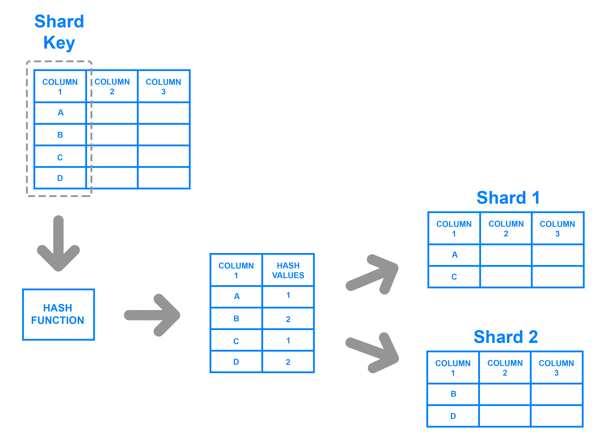

## Definición **NoSQL**

Si definimos **NoSQL** formalmente, podemos decir que se trata de un conjunto de tecnologías que permiten el procesamiento rápido y eficiente de conjuntos de datos dando la mayor importancia al rendimiento, la fiabilidad y la agilidad.

Si nos basamos en el acrónimo, el término da la sensación que se refiere a cualquier almacén de datos que no sigue un modelo relacional, los datos no son relacionales y por tanto no utilizan SQL como lenguaje de consulta. Realmente implica que el _No_ hace referencia a _not only_, es decir, que los sistemas **NoSQL** se centran en sistemas complementarios a los SGBD relacionales, que **fijan sus prioridades en la escalabilidad y la disponibilidad en contra de la atomicidad y consistencia** de los datos.

Es decir, más que sustitutos de los sistemas relacionales, las soluciones **NoSQL** se plantean como alternativas y complementarias a los sistemas gestores de bases de datos relacionales.

> **ACID** 
> 
> Las ***bases de datos relacionales*** cumplen las características **ACID** para ofrecer transaccionalidad sobre los datos:
> - **A**tomicidad: las transacciones implican que se realizan todas las operaciones o no se realiza ninguna.
> - **C**onsistencia: la base de datos asegura que los datos pasan de un estado válido o otro también.
> - **I**solation (Aislamiento): Una transacción no afecta a otras transacciones, de manera que la modificación de un registro / documento no es visible por otras lecturas.
> - **D**urabilidad: La escritura de los datos asegura que una vez finalizada una operación, los datos no se perderán.

Los diferentes tipos de bases de datos *NoSQL* existentes se pueden **agrupar en cuatro categorías**:

- **Clave-Valor**: Los almacenes clave-valor son las bases de datos *NoSQL* más simples. Cada elemento de la base de datos se almacena con un nombre de atributo (o clave) junto a su valor, a modo de diccionario. Los almacenes más conocidos son [Redis](https://redis.io), [Riak](https://riak.com) y [AWS DynamoDB](https://aws.amazon.com/es/dynamodb/). Algunos almacenes, como es el caso de _Redis_, permiten que cada valor tenga un tipo (por ejemplo, _integer_) lo cual añade funcionalidad extra.
    
- **Documentales**: Cada clave se asocia a una estructura compleja que se conoce como documento. Este puede contener diferentes pares clave-valor, o pares de clave-array o incluso documentos anidados, como en un documento JSON. Los ejemplos más conocidos son [MongoDB](https://www.mongodb.com), [CouchDB](https://couchdb.apache.org/) o [Elastic Search](https://www.elastic.co/es/).
    
- **Grafos**: Los almacenes de grafos se usan para almacenar información sobre redes, como pueden ser conexiones sociales. Los ejemplos más conocidos son [Neo4j](https://neo4j.com/), [Amazon Neptune](https://aws.amazon.com/es/neptune/) y [ArangoDB](https://arangodb.com/).
    
- **Basados en columnas**: Los almacenes basados en columnas como [Hypertabla de Google](https://hypertable.com/), [Apache Cassandra](https://cassandra.apache.org/_/index.html) y [Apache HBase](https://hbase.apache.org/) están optimizados para consultas sobre grandes conjuntos de datos, y almacenan los datos como columnas en vez de como filas.
    

    

## Características

Si nos centramos en sus beneficios y los comparamos con las base de datos relacionales, las bases de datos *NoSQL* son **más escalables**, ofrecen un **rendimiento mayor** y sus **modelos de datos resuelven varios problemas** que no se plantearon al definir el modelo relacional:

- **Grandes volúmenes de datos estructurados, semi-estructurados y sin estructurar**. Casi todas las implementaciones *NoSQL* ofrecen algún tipo de representación para datos sin esquema, lo que permite comenzar con una estructura y con el paso del tiempo, añadir nuevos campos, ya sean sencillos o anidados a datos ya existentes.
- **Sprints ágiles**, iteraciones rápidas y frecuentes _commits_/_pushes_ de código, al emplear una sintaxis sencilla para la realización de consultas y la posibilidad de tener un modelo que vaya creciendo al mismo ritmo que el desarrollo.
- **Arquitectura eficiente y escalable diseñada para trabajar con clusters** en vez de una arquitectura monolítica y costosa. Las soluciones *NoSQL* soportan la escalabilidad de un modo transparente para el desarrollador y ofrecen una solución cloud.

Una característica adicional que comparten los sistemas *NoSQL* es que ofrecen un mecanismo de caché de datos integrado (en los sistemas relacionales se pueden configurar de manera externa), pudiendo configurar los sistemas para que los datos se mantengan en memoria y se persistan de manera periódica. El uso de una caché conlleva que la consistencia de los datos no sea completa y podamos tener una consistencia eventual.

## Esquemas dinámicos

Las bases de datos relacionales requieren definir los esquemas antes de añadir los datos. Una base de datos SQL necesita saber de antemano los datos que vamos a almacenar; por ejemplo, si nos centramos en los datos de un cliente, serían el nombre, apellidos, número de teléfono, etc…​

Esto casa bastante mal con los enfoques de desarrollo ágil, ya que cada vez que añadimos nuevas funcionalidades, el esquema de la base de datos suele cambiar. De modo que si a mitad de desarrollo decidimos almacenar los productos favoritos de un cliente del cual guardábamos su dirección y números de teléfono, tendríamos que añadir una nueva columna a la base de datos y migrar la base de datos entera a un nuevo esquema.

Si la base de datos es grande, conlleva un proceso lento que implica parar el sistema durante un tiempo considerable. Si frecuentemente cambiamos los datos que la aplicación almacena (al usar un desarrollo iterativo), también tendremos períodos frecuentes de inactividad del sistema, a no ser que utilicemos un [despliegue azul/verde](https://medium.com/devopslatam/introducci%C3%B3n-a-los-despliegues-azul-verde-bb4055811279) y tengamos redundancia de nuestro sistema de almacenamiento. Así pues, no hay un modo efectivo mediante una base de datos relacional de almacenar los datos que están desestructurados o que no se conocen de antemano.

Las bases de datos *NoSQL* se construyen para permitir la inserción de datos **sin un esquema predefinido**. Esto facilita la modificación de la aplicación en tiempo real, sin preocuparse por interrupciones de servicio. Aunque no tengamos un esquema al guardar la información, sí que podemos definir esquemas de lectura (_schema-on-read_) para comprobar que la información almacenada tiene el formato que espera cargar cada aplicación.

De este modo se consigue un desarrollo más rápido, integración de código más robusto y menos tiempo empleado en la administración de la base de datos.

Aunque lo veremos en profundidad en las siguientes sesiones, los modelos de datos *NoSQL* **priman la redundancia de los datos, denormalizando los datos para evitar el uso de _joins_**. Por ello, es importante que la definición de los esquemas sea flexible para poder añadir campos conforme la aplicación evolucione.

## Particionado

Dado el modo en el que se estructuran las bases de datos relacionales, normalmente escalan verticalmente - un único servidor que almacena toda la base de datos para asegurar la disponibilidad continua de los datos. Esto se traduce en costes que se incrementan rápidamente, con un límites definidos por el propio hardware, y en un pequeño número de puntos críticos de fallo dentro de la infraestructura de datos.

La solución es escalar horizontalmente, añadiendo nuevos servidores en vez de concentrarse en incrementar la capacidad de un único servidor, lo que permite tratar con conjuntos de datos más grandes de lo que sería capaz cualquier máquina por sí sola. Este escalado horizontal se conoce como **_Sharding_** o Particionado.

El particionado no es único de las bases de datos *NoSQL*. Las bases de datos relacionales también lo soportan. Si en un sistema relacional queremos particionar los datos, podemos distinguir entre particionado:

- **Horizontal**: diferentes filas en diferentes particiones.
- **Vertical**: diferentes columnas en particiones distintas.

    

En el caso de las bases de datos *NoSQL*, el particionado depende del modelo de la base de datos:

- Los almacenes clave-valor y las bases de datos documentales normalmente se particionan horizontalmente.
- Las bases de datos basados en columnas se pueden particionar horizontal o verticalmente.

Escalar horizontalmente una base de datos relacional entre muchas instancias de servidores se puede conseguir pero normalmente conlleva el uso de SANs (_Storage Area Networks_) y otras triquiñuelas para hacer que el hardware actúe como un único servidor.

Como los sistemas SQL no ofrecen esta prestación de forma nativa, los equipos de desarrollo se las tienen que ingeniar para conseguir desplegar múltiples bases de datos relacionales en varias máquinas. Para ello:

- Los datos se almacenan en cada instancia de base de datos de manera autónoma
- El código de aplicación se desarrolla para distribuir los datos y las consultas y agregar los resultados de los datos a través de todas las instancias de bases de datos
- Se debe desarrollar código adicional para gestionar los fallos sobre los recursos, para realizar joins entre diferentes bases de datos, balancear los datos y/o replicarlos, etc…​

Además, muchos beneficios de las bases de datos como la integridad transaccional se ven comprometidos o incluso eliminados al emplear un escalado horizontal.

### Auto-sharding

Por contra, las bases de datos *NoSQL* normalmente soportan **_auto-sharding_**, lo que implica que de manera nativa y automáticamente se dividen los datos entre un número arbitrario de servidores, sin que la aplicación sea consciente de la composición del pool de servidores. Los datos y las consultas se balancean entre los servidores.

El particionado se realiza mediante un método consistente, como puede ser:

- Por **rangos** de su id: por ejemplo "los usuarios del 1 al millón están en la partición 1" o "los usuarios cuyo nombre va de la A a la L" en una partición, en otra de la M a la Q, y de la R a la Z en la tercera.
    

    

    
- Por **listas**: dividiendo los datos por la categoría del dato, es decir, en el caso de datos sobre libros, las novelas en una partición, las recetas de cocina en otra, etc..
    
- Mediante un función **_hash_**, la cual devuelve un valor para un elemento que determine a qué partición pertenece.
    

    

    

### Cuando particionar

El motivo para particionar los datos se debe a:

- **limitaciones de almacenamiento**: los datos no caben en un único servidor, tanto a nivel de disco como de memoria RAM.
- **rendimiento**: al balancear la carga entre particiones las escrituras serán más rápidas que al centrarlas en un único servidor.
- **disponibilidad**: si un servidor esta ocupado, otro servidor puede devolver los datos. La carga de los servidores se reduce.

No particionaremos los datos cuando la cantidad sea pequeña, ya que el hecho de distribuir los datos conlleva unos costes que pueden no compensar con un volumen de datos insuficiente. Tampoco esperaremos a particionar cuando tengamos muchísimos datos, ya que el proceso de particionado puede provocar sobrecarga del sistema.

La nube facilita de manera considerable este escalado, mediante proveedores como AWS o Azure los cuales ofrecen virtualmente una capacidad ilimitada bajo demanda, y despreocupándose de todas las tareas necesarias para la administración de la base de datos.

Los desarrolladores ya no necesitamos construir plataformas complejas para nuestras aplicaciones, de modo que nos podemos centrar en escribir código de aplicación. Una granja de servidores con _commodity hardware_ puede ofrecer el mismo procesamiento y capacidad de almacenamiento que un único servidor de alto rendimiento por mucho menos coste.

## Replicación

La **replicación** mantiene **copias idénticas** de los datos en múltiples servidores, lo que facilita que las aplicaciones siempre funcionen y los datos se mantengan seguros, incluso si alguno de los servidores sufre algún problema.

La mayoría de las bases de datos *NoSQL* también soportan la replicación automática, lo que implica una alta disponibilidad y recuperación frente a desastres sin la necesidad de aplicaciones de terceros encargadas de ello. Desde el punto de vista del desarrollador, el entorno de almacenamiento es virtual y ajeno al código de aplicación.

Existen dos formas de realiza la replicación:

### Maestro-esclavo / Primario-secundario

Todas las escrituras se realizan en el nodo principal y después se replican a los nodos secundarios. El nodo primario es un SPOF (_single point of failure_).

    

### Peer-to-Peer 

Todos los nodos tienen el mismo nivel jerárquico, de manera que todos admiten escrituras. Al poder haber escrituras simultáneas sobre el mismo datos en diferentes nodos, pueden darse inconsistencia en los datos.

    

La replicación de los datos se utiliza para alcanzar:

- **escalabilidad**, incrementando el rendimiento al poder distribuir las consultas en diferentes nodos, y mejorar la redundancia al permitir que cada nodo tenga una copia de los datos.
- **disponibilidad**, ofreciendo tolerancia a fallos de hardware o corrupción de la base de datos. Al replicar los datos vamos a poder tener una copia de la base de datos, dar soporte a un servidor de datos agregados, o tener nodos a modo de copias de seguridad que pueden tomar el control en caso de fallo.
- **aislamiento** (la i en ACID - _isolation_), entendido como la propiedad que define cuando y cómo al realizar cambios en un nodo se propagan al resto de nodos. Si replicamos los datos podemos crear copias sincronizadas para separar procesos de la base de datos de producción, pudiendo ejecutar informes, analítica de datos o copias de seguridad en nodos secundarios de modo que no tenga un impacto negativo en el nodo principal, así como ofrecer un sistema sencillo para separar el entorno de producción del de preproducción.

> **Nota**: ***Replicación vs particionado***: No hay que confundir la replicación (copia de los datos en varias máquinas) con el particionado (cada máquina tiene un subconjunto de los datos). El entorno más seguro y con mejor rendimiento es aquel que tiene los datos particionados y replicados (cada máquina que tiene un subconjunto de los datos está replicada en 2 o más).

## Implantando *NoSQL*

Normalmente, las empresas empezarán con una prueba de baja escalabilidad de una base de datos *NoSQL*, de modo que les permita comprender la tecnología asumiendo muy poco riesgo. La mayoría de las bases de datos *NoSQL* también son open-source, y por tanto se pueden probar sin ningún coste extra. Al tener unos ciclos de desarrollo más rápidos, las empresas pueden innovar con mayor velocidad y mejorar la experiencia de sus cliente a un menor coste.

**Elegir la base de datos correcta** para el proyecto es un tema importante. Se deben considerar las diferentes alternativas a las infraestructuras _legacy_ teniendo en cuenta varios factores:

- la escalabilidad o el rendimiento más allá de las capacidades del sistema existente.
- identificar alternativas viables respecto al software propietario.
- incrementar la velocidad y agilidad del proceso de desarrollo.

Así pues, al elegir un base de datos hemos de tener en cuenta las siguientes dimensiones:

- **modelo de datos**: A elegir entre un modelo documental, basado en columnas, de grafos o mediante clave-valor.
- **modelo de consultas**: Dependiendo de la aplicación, puede ser aceptable un modelo de consultas que sólo accede a los registros por su clave primaria. En cambio, otras aplicaciones pueden necesitar consultar por diferentes valores de cada registro. Además, si la aplicación necesita modificar los registros, la base de datos necesita consultar los datos por un índice secundario.
- **modelo de consistencia**: Los sistemas *NoSQL* normalmente mantienen múltiples copias de los datos para ofrecer disponibilidad y escalabilidad al sistema, lo que define la consistencia del mismo. Los sistemas *NoSQL* tienden a ser consistentes o eventualmente consistentes.
- **APIs**: No existe un estándar para interactuar con los sistemas *NoSQL*. Cada sistema presenta diferentes diseños y capacidades para los equipos de desarrollo. La madurez de un API puede suponer una inversión en tiempo y dinero a la hora de desarrollar y mantener el sistema *NoSQL*.
- **soporte comercial y de la comunidad**: Los usuarios deben considerar la salud de la compañía o de los proyectos al evaluar una base de datos. El producto debe evolucionar y mantenerse para introducir nuevas prestaciones y corregir fallos. Una base de datos con una comunidad fuerte de usuarios:
    
    - permite encontrar y contratar desarrolladores con destrezas en el producto.
    - facilita encontrar información, documentación y ejemplos de código.
    - ayuda a las empresas a retener el talento.
    - favorece que otras empresas de software integren sus productos y participen en el ecosistema de la base de datos.

## Casos de uso

Una vez conocemos los diferentes sistemas y qué elementos puede hacer que nos decidamos por una solución u otra, conviene repasar los casos de uso más comunes:

- si vamos a crear una aplicación web cuyo campos sean personalizables, usaremos una solución documental.
- como una capa de caché, mediante un almacén clave-valor.
- para almacenar archivos binarios sin preocuparse de la gestión de permisos del sistema de archivos, y poder realizar consultas sobre sus metadatos, ya sea mediante una solución documental o un almacén clave-valor.
- para almacenar un enorme volumen de datos, donde la consistencia no es lo más importante, pero si la disponibilidad y su capacidad de ser distribuida, mediante una solución documental o basada en columnas.

