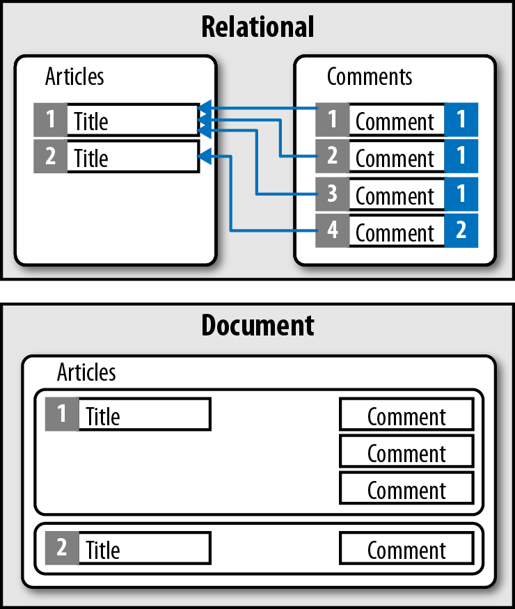
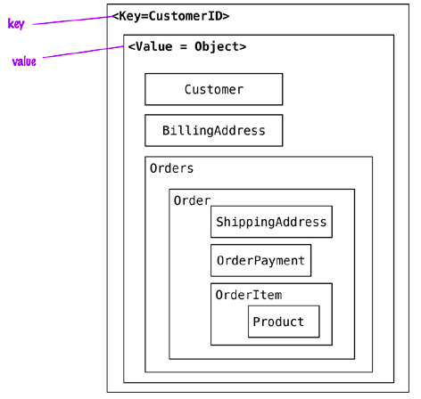
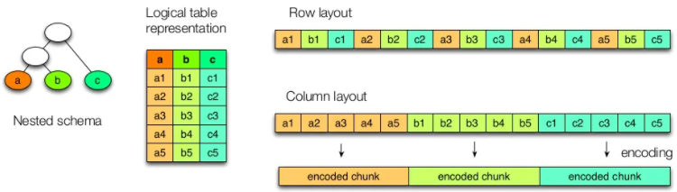

# Medelos de datos

## Modelos de Datos

La principal clasificación de los sistemas de bases de datos *NoSQL* se realiza respecto a los diferentes modelos de datos:

## Documental

Mientras las bases de datos relacionales almacenan los datos en filas y columnas, las bases de datos documentales emplean documentos. Estos documentos utilizan una estructura JSON, ofreciendo un modo natural e intuitivo para modelar datos de manera similar a la orientación a objetos, donde cada documento es un objeto.

<div align="center">
    
</div>

Los documentos se agrupan en colecciones o bases de datos, dependiendo del sistema, lo que permite agrupar documentos.

Los documentos contienen uno o más campos, donde cada campo contiene un valor con un tipo, ya sea cadena, entero, flotante, fecha, binario o array u otro documento. En vez de extender los datos entre múltiples columnas y tablas, cada registro y sus datos asociados se almacenan de manera unida en un único documento. Esto simplifica el acceso a los datos y reduce (y en ocasiones elimina) la necesidad de *joins* y transacciones complejas.

Dicho de otra manera, en las bases de datos documentales, los datos que van juntos y se emplean juntos, se almacenan juntos.

### Características

En una base de datos documental, la noción de **esquema es dinámico**: cada documento puede contener diferentes campos. Esta flexibilidad puede ser útil para modelar datos desestructurados y polimórficos, lo que facilita la evolución del desarrollo al permitir añadir nuevos campos de manera dinámica.

Perfectamente podemos tener dos documentos que pertenecen a la misma colección, pero con atributos diferentes. Por ejemplo, un primer documento puede ser el siguiente:

```json
{   
    "_id": "BW001",   
    "nombre": "Bruce",   
    "apellido": "Wayne",   
    "edad": 35,   
    "salario": 10000000 
}
```


Mientras que un segundo documento dentro de la misma colección podría ser:

```json
{
    "_id": "JK1",   
    "nombre": "Joker",   
    "edad": 34,   
    "salario": 5000000,   
    "direccion":                        (1)
    {               
        "calle": "Asilo Arkham",    
        "ciudad": "Gotham"   
    },   
    "proyectos":                        (2)
    [                  
        "desintoxicacion-virus",     
        "top-secret-007"   
    ] 
}
```

Donde 
  1.  Un objeto o subdocumento permite agrupar información similar a una relación ***1:1*** de un modelo relacional. De esta manera, no necesitamos una tabla `Direccion`.
  2.  Un array puede contener valores o documentos, de manera que podríamos tener un array de documentos, permitiendo agrupar información similar a una relación ***1:N*** de un modelo relacional. De esta manera, no necesitamos una tabla `Proyectos`.

Normalmente, cada documento contiene **un elemento clave**, sobre el cual se puede obtener un documento de manera unívoca. De todos modos, las bases de datos documentales ofrecen un completo mecanismo de consultas, posibilitando obtener información por cualquier campo del documento. Algunos productos ofrecen opciones de indexado para optimizar las consultas, como pueden ser índices compuestos, dispersos, con tiempo de vida (TTL), únicos, de texto o geoespaciales.

Además, estos sistemas ofrecen productos que permiten analizar los datos, mediante funciones de agregación o implementación de *MapReduce*.

### Casos de uso

Las bases de datos documentales sirven para propósito general, válidos para un amplio abanico de aplicaciones gracias a la flexibilidad que ofrece el modelo de datos, lo que permite consultar cualquier campo y modelar de manera natural de manera similar a la programación orientada a objetos.

Entre los casos de éxito de estos sistemas cabe destacar:

- Sistemas de flujo de eventos: entre diferentes aplicaciones dentro de una empresa
- Gestores de Contenido, plataformas de Blogging: al almacenar los documentos mediante JSON, facilita la estructura de datos para guardar los comentarios, registros de usuarios, etc…​
- Analíticas Web, datos en Tiempo Real: al permitir modificar partes de un documento, e insertar nuevos atributos a un documento cuando se necesita una nueva métrica
- Aplicaciones eCommerce: conforme las aplicaciones crecen, el esquema también lo hace

Si nos centramos en aquellos casos donde no conviene este tipo de sistemas podemos destacar:

- Sistemas operacionales con transacciones complejas.
- Sistemas con consultas agregadas que modifican su estructura. Si los criterios de las consultas no paran de cambiar, acabaremos normalizando los datos.

Los productos más destacados son:

- _MongoDB_: [http://www.mongodb.com](http://www.mongodb.com). 
- _CouchDB_: [http://couchdb.apache.org](http://couchdb.apache.org)

## Clave-Valor

Un almacén clave-valor es una simple tabla _hash_ donde todos los accesos a la base de datos se realizan a través de la clave primaria.

Desde una perspectiva de **modelo de datos**, los almacenes de clave-valor son los **más básicos**.

Su funcionamiento es similar a tener una tabla relacional con dos columnas, por ejemplo `id` y `nombre`, siendo `id` la columna utilizada como clave y `nombre` como valor. Mientras que en una base de datos en el campo `nombre` sólo podemos almacenar datos de tipo cadena o numérico, en un almacén clave-valor, el valor puede ser de un dato simple o un objeto. En muchos casos, se almacena un objeto binario BLOB (_Binary Large Object_). Cuando una aplicación accede mediante la clave y el valor, se almacenan el par de elementos. Si la clave ya existe, el valor se modifica.

<div align="center">
    
</div>


El cliente puede tanto obtener el valor por la clave, asignar un valor a una clave o eliminar una clave del almacén. El valor, sin embargo, es opaco al sistema, el cual no sabe que hay dentro de él, ya que los datos sólo se pueden consultar por la clave, lo cual puede ser un inconveniente. Así pues, la aplicación es responsable de saber qué hay almacenado en cada valor.

Por ejemplo, [Riak](https://riak.com) utiliza el concepto de _bucket_ (cubo) como una manera de agrupar claves, de manera similar a una tabla.

Por ejemplo, _Riak_ permite interactuar con la base de datos mediante peticiones HTTP:

```bash
curl -v -X PUT <http://localhost:8091/riak/heroes/ace> -H "Content-Type: application/json" -d {"nombre" : "Batman", "color" : "Negro"}
```

Algunos almacenes clave-valor, como puede ser [Redis](https://redis.io), permiten almacenar datos con cualquier estructura, como por ejemplos listas, conjuntos, hashes, permitiendo realizar operaciones como la intersección, unión, diferencia y rango.

Comandos ***Redis***
```Redis
SET nombre "Bruce Wayne"      // String 
HSET heroe nombre "Batman"    // Hash – set 
HSET heroe color "Negro" 
SADD "heroe:amigos" "Robin" "Alfred"   // Set – create/update
```

Comandos ***Python***

```python
import redis 
r = redis.Redis() 
r.mset({"Croatia": "Zagreb", "Bahamas": "Nassau"}) 
r.get("Bahamas") # b'Nassau'
```

Estas prestaciones hacen que _Redis_ se extrapole a ámbitos ajenos a un almacén clave-valor. Otra característica que ofrecen algunos almacenes es que permiten crear un segundo nivel de consulta o incluso definir más de una clave para un mismo objeto.

Como los almacenes clave-valor siempre utilizan accesos por clave primaria, de manera general tienen un gran rendimiento y son fácilmente escalables.

Si queremos que su rendimiento sea máximo, pueden configurarse para que mantengan la información en memoria y que se serialice de manera periódica, a costa de tener una consistencia eventual de los datos.


### Diferencias entre modelo Documental y Clave-Valor

Los modelos de datos Documental y Clave-Valor son dos paradigmas comunes en las bases de datos *NoSQL*. Pueden parecer similares pero existen unas diferencias claras entre ellos: 

- **Estructura de datos:** En el modelo documental, los datos se organizan en documentos con una estructura interna, mientras que en el modelo clave-valor, los datos se almacenan como pares de clave-valor simples sin una estructura interna definida.

- **Flexibilidad:** El modelo documental ofrece más flexibilidad para almacenar datos semiestructurados o no estructurados, mientras que el modelo clave-valor es más adecuado para datos simples y bien definidos.

- **Consultas:** El modelo documental permite consultas más complejas y flexibles utilizando índices secundarios y lenguajes de consulta avanzados, mientras que en el modelo clave-valor, la recuperación de datos se realiza principalmente mediante búsquedas directas por clave.

### Casos de uso

Este modelo es muy útil para representar datos desestructurados o polimórficos, ya que no fuerzan ningún esquema más allá de los pares de clave-valor.

Entre los casos de uso de estos almacenes podemos destacar el almacenaje de:

- Información sobre la sesión de navegación (_sessionid_)
- Perfiles de usuario, preferencias
- Datos del carrito de la compra
- Cachear datos

Todas estas operaciones van a asociada a operaciones de recuperación, modificación o inserción de los datos de una sola vez, de ahí su elección.

En cambio, no conviene utilizar estos almacenes cuando queremos realizar:

- Relaciones entre datos
- Transacciones entre varias operaciones
- Consultas por los datos del valor
- Operaciones con conjuntos de claves

Los almacenes más empleados son:

- _Riak_: [https://riak.com](https://riak.com)
- _Redis_: [http://redis.io](http://redis.io)
- _AWS DynamoDB_: [http://aws.amazon.com/dynamodb](http://aws.amazon.com/dynamodb)
- _Voldemort_: [http://www.project-voldemort.com/voldemort](http://www.project-voldemort.com/voldemort) implementación open-source de _Amazon DynamoDB_

## Basado en columnas

Las bases de datos relacionales utilizan la fila como unidad de almacenamiento, lo que permite un buen rendimiento de escritura. Sin embargo, cuando las **escrituras son ocasionales** y es más común tener que leer unas pocas columnas de muchas filas a la vez, es mejor utilizar como unidad de almacenamiento un **grupos de columnas**. Es decir, lo que hacemos es girar el modelo 90 grados, de manera que **los registros se almacenan en columnas en vez de hacerlo por fila**s.

Supongamos que tenemos los siguientes datos:

<div align="center">
    
</div>

Dependiendo del almacenamiento en filas o columnas tendríamos la siguiente representación:

<div align="center">
    
</div>

En un formato columnar los datos del mismo tipo se agrupan, lo que permite codificarlos/comprimirlos, lo que mejora el rendimiento de acceso y reduce el tamaño:

<div align="center">
    
</div>

**Sin embargo, a medida que se incrementa la utilización de análisis de datos en memoria**, con soluciones como _Spark_, **los beneficios** relativos de la base de datos columnar comparados con los de las bases de datos orientadas a filas pueden llegar a ser **menos importantes**.

### Representación

Un modelo basado en columnas se representa como una estructura agregada de dos niveles. El primer nivel formado por un almacén clave-valor, siendo la clave el identificador de la fila, y el valor un nuevo mapa con los datos agregados de la fila (familias de columnas). Los valores de este segundo nivel son las columnas. De este modo, podemos acceder a los datos de un fila, o a una determinada columna:

<div align="center">
    
</div>s

> **BigTable**:  Los modelos de datos basados en columnas se basan en la implementación de _Google_ de la tecnología _BigTable_ ([http://research.google.com/archive/bigtable.html](https://research.google.com/archive/bigtable.html)), la cual consiste en columnas separadas y sin esquema, a modo de mapa de dos niveles.

Así pues, los almacenes basados en columnas utilizan un mapa ordenado multi-dimensional y distribuido para almacenar los datos. Están pensados para que cada fila tenga una gran número de columnas (del orden del millón), almacenando las diferentes versiones que tenga una fila (pudiendo almacenar del orden de miles de millones de filas).

### Familias de columnas

Una **columna** consiste en un pareja `name`\-`value`, donde el nombre hace de clave. Además, contiene un atributo `timestamp` para poder expirar datos y resolver conflictos de escritura.

Un ejemplo de columna podría ser:

```js
{
    name: "nombre",   
    value: "Bruce",   
    timestamp: 12345667890 
}
```

Una fila es una colección de columnas agrupadas a una clave.

```js
{
    {         
        name: "nombre",         
        value: "Bruce",         
        timestamp: 12345667890     
    },     
    {         
        name: "nombre",         
        value: "Clark",         
        timestamp: 12345667891     
    },     
    {         
        name: "nombre",         
        value: "Barbara",         
        timestamp: 12345667892     
    } 
}
```

Si agrupamos filas similares tendremos una **familia de columnas** (similar al concepto de tabla):

```js
// familia de columnas 
{   
    // fila   
    "tim-gordon" : 
    {     
        nombre: "Tim",     
        apellido: "Gordon",     
        ultimaVisita: "2015/12/12"   
    }   
    // fila   
    "bruce-wayne" : 
    {     
        nombre: "Bruce",     
        apellido: "Wayne",     
        lugar: "Gotham"   
    } 
}
```

Con este ejemplo, podemos ver como las diferentes filas de la misma tabla (familia de columnas) no tienen por que compartir el mismo conjunto de columnas.

Además, las columnas se pueden anidar dentro de otras formando **super-columnas**, donde el valor es un nuevo mapa de columnas.

```js
{
    name: "libro:978-84-16152-08-7",   
    value: 
    {     
        autor: "Grant Morrison",     
        titulo: "Batman - Asilo Arkham",     
        isbn: "978-84-16152-08-7"   
    } 
}
```

Cuando se utilizan super columnas para crear familias de columnas tendremos una familia de super columnas.

En resumen, las bases de datos basadas en columnas, almacenan los datos en familias de columnas como filas, las cuales tienen muchas columnas asociadas al identificador de una fila. Las familias de columnas son grupos de datos relacionados, a las cuales normalmente se accede de manera conjunta.

### Operaciones

A la hora de consultar los datos, éstos se pueden obtener por la clave primaria de la familia. Así pues, podemos obtener toda una familia, o la columna de una familia:

```cassandra
// Mediante Cassandra 
GET Clientes['bruce-wayne'];            // familia 
GET Clientes['bruce-wayne']['lugar'];   // columna
````

Algunos productos ofrecen un soporte limitado para índices secundarios, pero con restricciones. Por ejemplo, _Cassandra_ ofrece el lenguaje CQL similar a SQL pero sin joins, ni subconsultas donde las restricciones de _where_ son sencillas:

```sql
SELECT * FROM Clientes 
SELECT nombre,email FROM Clientes 
SELECT nombre,email FROM Clientes WHERE lugar='Gotham'`
```
Las actualizaciones se realizan en dos pasos: primero encontrar el registro y segundo modificarlo. En estos sistemas, una modificación puede suponer una reescritura completa del registro independientemente que hayan cambiado unos pocos _bytes_ del mismo.

### Casos de uso

Las bases de datos columnares se han empleado durante décadas ofreciendo beneficios a las aplicaciones de negocio modernas, como la analítica de datos, _business intelligence_ y _data warehousing_.

Son multipropósito, aunque su uso se centra en el mercado del big data, la analítica de datos, cubos multidimensionales OLAP y/o almacenar metadatos y realizar analítica en tiempo real.

Además de poder comprimir los datos, los datos están auto-indexados, lo que implica que utiliza menos espacio en disco, y acelera la ejecución de consultas agregadas entre múltiples tablas que implica el uso de joins.

En cambio, no se recomienda su uso en aplicaciones de procesamiento transaccional (OLTP), ya que las bases de datos relacionales gestionan mejor el procesamiento concurrente y el aislamiento de las operaciones.

Los productos más destacados son:

- _HBase_ : [http://hbase.apache.org](http://hbase.apache.org), el cual se basa en _Hadoop_ - [http://hadoop.apache.org](http://hadoop.apache.org)
- _Cassandra_ : [http://cassandra.apache.org](http://cassandra.apache.org)
- _Amazon Redshift_: [https://aws.amazon.com/es/redshift/](https://aws.amazon.com/es/redshift/)

## Grafos

Las bases de datos de grafos almacenan entidades y las relaciones entre estas entidades. Las entidades se conocen como nodos, los cuales tienen propiedades. Cada nodo es similar a una instancia de un objeto. Las relaciones, también conocidas como vértices, a su vez tienen propiedades, y su sentido es importante.

<div align="center">
    
</div>

Los nodos se organizan mediante relaciones que facilitan encontrar patrones de información existente entre los nodos. Este tipo de organización permite almacenar los datos una vez e interpretar los datos de diferentes maneras dependiendo de sus relaciones.

Los nodos son entidades que tienen propiedades, tales como el nombre. Por ejemplo, en el gráfico cada nodo tiene una propiedad `name`. También podemos ver que las relaciones tienen tipos, como `label`, `since`, etc…​ Estas propiedades permiten organizar los nodos. Las relaciones pueden tener múltiples propiedades, y además tienen dirección, con lo cual si queremos incluir bidireccionalidad tenemos que añadir dos relaciones en sentidos opuestos. Tanto los nodos como las relaciones tienen un atributo `id` que los identifica.

Por ejemplo, podemos comenzar a crear el grafo anterior mediante Neo4J de la siguiente manera:

```Neo4J
Node alice = graphDb.createNode();
alice.setProperty("name", "Alice");
Node bob = graphDb.createNode();
bob.setProperty("name", "Bob");

alice.createRelationshipTo(bob, FRIEND);
bob.createRelationshipTo(alice, FRIEND);
```

Los nodos permiten tener diferentes tipos de relaciones entre ellos y así representar relaciones entre las entidades del dominio, y tener relaciones secundarias para características como categoría, camino, árboles de tiempo, listas enlazas para acceso ordenado, etc…​ Al no existir un límite en el número ni en el tipo de relaciones que puede tener un nodo, todas se pueden representar en la misma base de datos.

### Traversing

Una vez tenemos creado un grafo de nodos y relaciones, podemos consultar el grafo de muchas maneras; por ejemplo "_obtener todos los nodos que son miembros del grupo de ajedrez y que tienen más de 20 años_". Realizar una consulta se conoce como hacer un _traversing_ (recorrido) del mismo.

Un ejemplo de _traversing_ mediante _Neo4J_ sería:

```js
Node ajedrez = nodeIndex.get("name", "chess").getSingle();
allRelationships = ajedrez.getRelationships(Direction.INCOMING);
```

Una ventaja a destacar de las bases de datos basadas en grafos es que podemos cambiar los requisitos de _traversing_ sin tener que cambiar los nodos o sus relaciones.

En las bases de datos de grafos, recorrer las relaciones es muy rápido, ya que no se calculan en tiempo de consulta, sino que se persisten como una relación, y por tanto no hay que hacer ningún cálculo.

En cambio, en una base de datos relacional, para crear una estructura de grafo se realiza para una relación sencilla (_¿Quien es mi jefe?"_). Para poder añadir otras relaciones necesitamos muchos cambios en el esquema y trasladar datos entre tablas. Además, necesitamos de antemano saber qué consultas queremos realizar para modelar las tablas y las relaciones acorde a las consultas.

Así pues, estos sistemas ofrecen modelos ricos de consultas donde se pueden investigar las relaciones simples y complejas entre los nodos para obtener información directa e indirecta de los datos del sistemas. Los tipos de análisis que se realizan sobre estos sistema se ciñen a los tipos de relación existente entre los datos.

### Casos de uso

Mientras que el modelo de grafos no es muy intuitivo y tiene una importante curva de aprendizaje, se puede usar en un gran número de aplicaciones.

Su principal atractivo es que facilitan almacenar las relaciones entre entidades de una aplicación, como por ejemplo en una red social, o las intersecciones existentes entre carreteras. Es decir, se emplean para almacenar datos que se representan como nodos interconectados.

Por lo tanto, los casos de uso son:

- Datos conectados: redes sociales con diferentes tipos de conexiones entre los usuarios.
- Enrutamiento, entrega o servicios basados en la posición: si las relaciones almacenan la distancia entre los nodos, podemos realizar consultas sobre lugares cercanos, trayecto más corto, etc…​
- Motores de recomendaciones: de compras, de lugares visitados, etc…​

En cambio, no se recomienda su uso cuando necesitemos modificar todos o un subconjunto de entidades, ya que modificar una propiedad en todos los nodos es una operación compleja.

Los productos más destacados son:

- _Neo4j_: [http://neo4j.com](http://neo4j.com)
- _ArangoDB_: [https://www.arangodb.com/](https://www.arangodb.com/)
- _Apache TinkerPop_: [https://tinkerpop.apache.org/](https://tinkerpop.apache.org/)
- _Amazon Neptune_: [https://aws.amazon.com/es/neptune/](https://aws.amazon.com/es/neptune/)


## Diferencias entre los modelos

| Aspecto                | Documental                | Clave-Valor           | Basado en Columnas     | Grafos                   |
|------------------------|---------------------------|-----------------------|-------------------------|--------------------------|
| **Estructura de Datos**| Documentos JSON/BSON/XML  | Pares de Clave-Valor  | Columnas con familias  | Nodos y Relaciones       |
| **Flexibilidad**       | Flexible                  | Variable              | Menos flexible          | Variable                |
| **Consultas**          | Complejas, utilizando índices secundarios y lenguajes de consulta avanzados | Búsquedas directas por clave | Consultas ad-hoc limitadas | Consultas complejas de relaciones |
| **Escalabilidad**      | Escalabilidad Horizontal  | Escalabilidad Horizontal | Escalabilidad Horizontal | Escalabilidad Horizontal y Vertical |
| **Transacciones**      | Transacciones ACID        | Operaciones atómicas simples | Transacciones ACID      | Transacciones ACID      |
| **Ejemplos**           | MongoDB, Couchbase        | Redis, DynamoDB       | Cassandra, HBase        | Neo4j, Amazon Neptune   |

