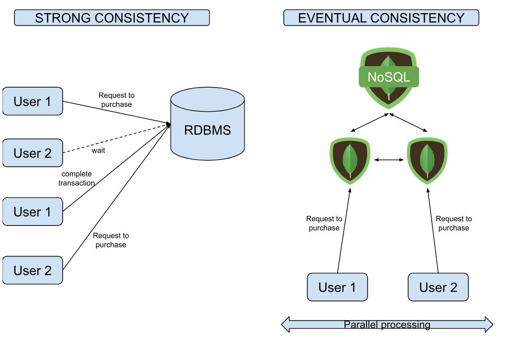
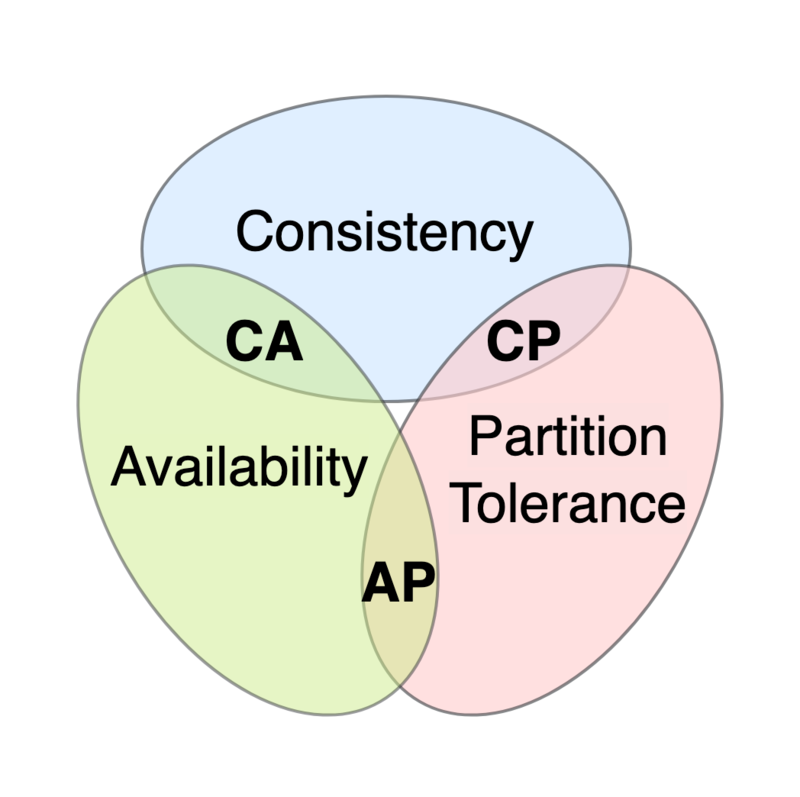
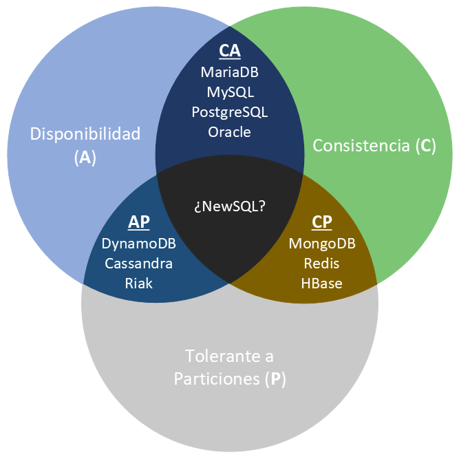

## Consistencia
En un sistema consistente, las escrituras de una aplicación son visibles en siguientes consultas. Con una consistencia eventual, las escrituras no son visibles inmediatamente.

Por ejemplo, en un sistema de control de stock, si el sistema es consistente, cada consulta obtendrá el estado real del inventario, mientras que si tiene consistencia eventual, puede que no sea el estado real en un momento concreto pero terminará siéndolo en breve.

<figure markdown="span" align="center">
  { width="70%"  }
  <figcaption>Tipos de consistencia</figcaption>
</figure>

### Sistemas consistentes

Cada aplicación tiene diferentes requisitos para la consistencia de los datos. Para muchas aplicaciones, es imprescindible que los datos sean consistentes en todo momento. Como los equipos de desarrollo han estado trabajo con un modelo de datos relacional durante décadas, este enfoque parece natural. Sin embargo, en otras ocasiones, la consistencia eventual es un traspiés aceptable si conlleva una mayor flexibilidad en la disponibilidad del sistema.

Las bases de datos documentales y de grafos pueden ser consistentes o eventualmente consistentes. Por ejemplo, _MongoDB_ ofrece un consistencia configurable. De manera predeterminada, los datos son consistentes, de modo que todas las escrituras y lecturas se realizan sobre la copia principal de los datos. Pero como opción, las consultas de lectura, se pueden realizar con las copias secundarias donde los datos tendrán consistencia eventual. La elección de la consistencia se realiza a nivel de consulta.

### Sistemas de consistencia eventual

Con los sistemas eventualmente consistentes, hay un período de tiempo en el que todas las copias de los datos no están sincronizados. Esto puede ser aceptable para aplicaciones de sólo-lectura y almacenes de datos que no cambian frecuentemente, como los archivos históricos. Dentro del mismo saco podemos meter las aplicaciones con alta tasa de escritura donde las lecturas sean poco frecuentes, como un archivo de log.

Un claro ejemplo de sistema eventualmente consistente es el servicio DNS, donde tras registrar un dominio, puede tardar varios días en propagar los datos a través de Internet, pero siempre están disponibles aunque contenga una versión antigua de los datos.

Respecto a las bases de datos *NoSQL*, los almacenes de clave-valor y los basados en columnas son sistemas eventualmente consistentes. Estos tienen que soportar conflictos en las actualizaciones de registros individuales.

Como las escrituras se pueden aplicar a cualquier copia de los datos, puede ocurrir, y no sería muy extraño, que hubiese un conflicto de escritura.

Algunos sistemas como _Riak_ utilizan vectores de reloj para determinar el orden de los eventos y asegurar que la operación más reciente gana en caso de un conflicto.

Otros sistemas como _CouchDB_, retienen todos los valores conflictivos y permiten al usuario resolver el conflicto. Otro enfoque seguido por _Cassandra_ sencillamente asume que el valor más grande es el correcto.

Por estos motivos, las escrituras tienden a comportarse bien en sistemas eventualmente consistentes, pero las actualizaciones pueden conllevar sacrificios que complican la aplicación.

## Teorema CAP

Propuesto por _Eric Brewer_ en el año 2000, prueba que podemos crear una base de datos distribuida que elija dos de las siguientes tres características:

- **C**onsistencia: las escrituras son atómicas y todas las peticiones posteriores obtienen el nuevo valor, independientemente del lugar de la petición.
- Disponibilidad (_**A**vailable_): la base de datos devolverá siempre un valor. En la práctica significa que no hay _downtime_.
- Tolerancia a **P**articiones: el sistema funcionará incluso si la comunicación con un servidor se interrumpe de manera temporal (para ello, ha de dividir los datos entre diferentes nodos). Es decir, implica que se pueden recibir lecturas desde unos nodos que no contienen información escrita en otros.

En otras palabras, podemos crear un sistema de base de datos que sea consistente y tolerante a particiones (CP), un sistema que sea disponible y tolerante a particiones (AP), o un sistema que sea consistente y disponible (CA). Pero no es posible crear una base de datos distribuida que sea consistente, disponible y tolerante a particiones al mismo tiempo.

<figure markdown="span" align="center">
  { width="65%"  }
  <figcaption>Teorema de CAP</figcaption>
</figure>

El teorema CAP es útil cuando consideramos el sistema de base de datos que necesitamos, ya que nos permite decidir cual de las tres características vamos a descartar. La elección realmente se centra entre la disponibilidad y la consistencia, ya que la tolerancia a particiones es una decisión de arquitectura (sea o no distribuida).

Aunque el teorema dicte que si en un sistema distribuido elegimos disponibilidad no podemos tener consistencia, todavía podemos obtener consistencia eventual. Es decir, cada nodo siempre estará disponible para servir peticiones, aunque estos nodos no puedan asegurar que la información que contienen sea consistente (pero si bastante precisa), en algún momento lo será.

Algunas bases de datos tolerantes a particiones se pueden ajustar para ser más o menos consistentes o disponible a nivel de petición. Por ejemplo, _Riak_ trabaja de esta manera, permitiendo a los clientes decidir en tiempo de petición qué nivel de consistencia necesitan.

### Clasificación según CAP

El siguiente gráfico muestra cómo dependiendo de estos atributos podemos clasificar los sistemas *NoSQL*:

<figure markdown="span" align="center">
  { width="75%"  }
  <figcaption>Clasificación según teorema de CAP</figcaption>
</figure>

Así pues, las bases de datos *NoSQL* se clasifican en:

- **CP**: Consistente y tolerantes a particiones. Tanto _MongoDB_ como _HBase_ son CP, ya que dentro de una partición pueden no estar disponibles para responder una determinada consulta (por ejemplo, evitando lecturas en los nodos secundarios), aunque son tolerantes a fallos porque cualquier nodo secundario se puede convertir en principal y asumir el rol del nodo caído.
- **AP**: Disponibles y tolerantes a particiones. _DynamoDB_ permite replicar los datos entre sus nodos aunque no garantiza la consistencia en ninguno de los sus servidores.
- **CA**: Consistentes y disponible. Aquí es donde situaríamos a los SGDB relacionales. Por ejemplo, _PostreSQL_ es CA (aunque ofrece un producto complementario para dar soporte al particionado, como PgCluster), ya que no distribuyen los datos y por tanto la partición no es una restricción.

Lo bueno es que la gran mayoría de sistemas permiten configurarse para cambiar su tipo CAP, lo que permite que _MongoDB_ pase de CP a AP, o _CouchDB_ de AP a CP.

### BASE

De forma análoga al modelo transaccional [ACID](#2-no-solo-sql) para las bases de datos relacionales que dan soporte a la transaccionalidad ofreciendo en todo momento un sistema consistente, las bases de datos distribuidas siguen el modelo transaccional BASE, el cual se centra en la alta disponibilidad y significa:

- Básicamente disponible (**_B_**_asically_ **_A_**_vailable_): la base de datos siempre responde a las solicitudes recibidas, ya sea con una respuesta exitosa o con un error, aún en el caso de que el sistema soporte la tolerancia a particiones (de manera que caiga algún nodo o no esté accesible por problemas de la red). Esto puedo implicar lecturas desde nodos que no han recibido la última escritura, por lo que el resultado puede no ser consistente.
- Estado blando (**_S_**_oft State_): la base de datos puede encontrarse en un estado inconsistente cuando se produce una lectura, de modo que es posible realizar dos veces la misma lectura y obtener dos resultados distintos a pesar de que no haya habido ninguna escritura entre ambas operaciones, sino que la escritura se había realizado antes en el tiempo y no se había persistido hasta ese momento.
- Consistencia eventual (**_E_**_ventual consistency_): tras cada escritura, la consistencia de la base de datos sólo se alcanza una vez el cambio ha sido propagado a todos los nodos. Durante el tiempo que tarda en producirse la consistencia, observamos un estado blando de la base de datos.

Una base de datos que sigue el modelo transaccional BASE prefiere la disponibilidad antes que la consistencia (es decir, desde el punto de vista del teorema CAP es AP).

<figure markdown="span" align="center">
  { width="75%"  }
  <figcaption>ACID vs BASE.</figcaption>
</figure>

